# DC02 Replication and DNS Redundancy

## Overview

This lab focuses on adding DC02 as an additional Domain Controller in the `Days.local` domain.

The main goal was to improve Active Directory availability and reduce dependency on one Domain Controller only.

After adding DC02, I verified Active Directory replication, Domain Controller discovery, DNS resolution, and DNS redundancy for domain clients.

This is a lab environment, but the idea is close to real infrastructure design where more than one Domain Controller is used for availability.

---

## Lab Environment

| Server / Client | Role                                 | IP Address   |
| --------------- | ------------------------------------ | ------------ |
| DC01            | Primary Domain Controller, DNS, DHCP | 192.168.1.10 |
| DC02            | Additional Domain Controller, DNS    | 192.168.1.11 |
| DYS-HR-01       | Domain Client                        | DHCP         |

Domain name:

```text
Days.local
```

---

## Lab Goals

The goals of this lab were:

* Add DC02 as an additional Domain Controller.
* Verify that DC01 and DC02 are both available in Active Directory.
* Verify Active Directory replication between DC01 and DC02.
* Configure DHCP to provide two DNS servers to clients.
* Test DNS resolution using DC01 and DC02.
* Understand DNS failover behavior from the client side.
* Document troubleshooting during the test.

---

## Part 1: Additional Domain Controller

DC02 was configured with a static IP address and joined to the `Days.local` domain.

After that, DC02 was promoted as an additional Domain Controller and DNS server.

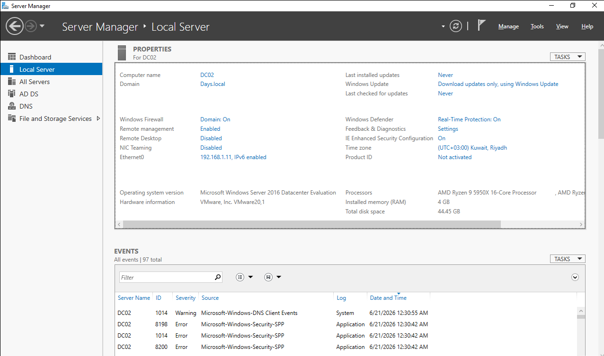

DC01 and DC02 are both visible under the Domain Controllers OU.

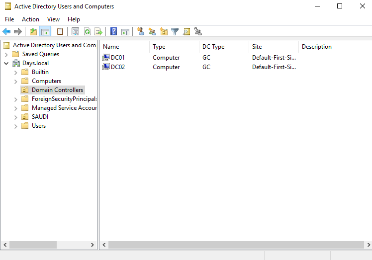

---

## Replication Verification

I used the following command to verify Active Directory replication:

```powershell
repadmin /replsummary
```

The result showed 0 replication failures between DC01 and DC02.

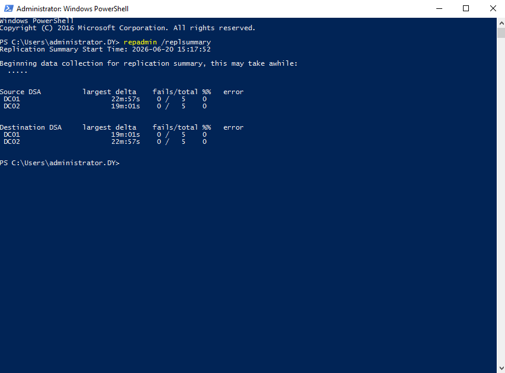

This confirms that replication between the Domain Controllers is working successfully.

---

## Domain Controller Discovery

I used the following command to check if the domain can discover DC02:

```powershell
nltest /dsgetdc:Days.local
```

The result returned DC02 as a discovered Domain Controller.

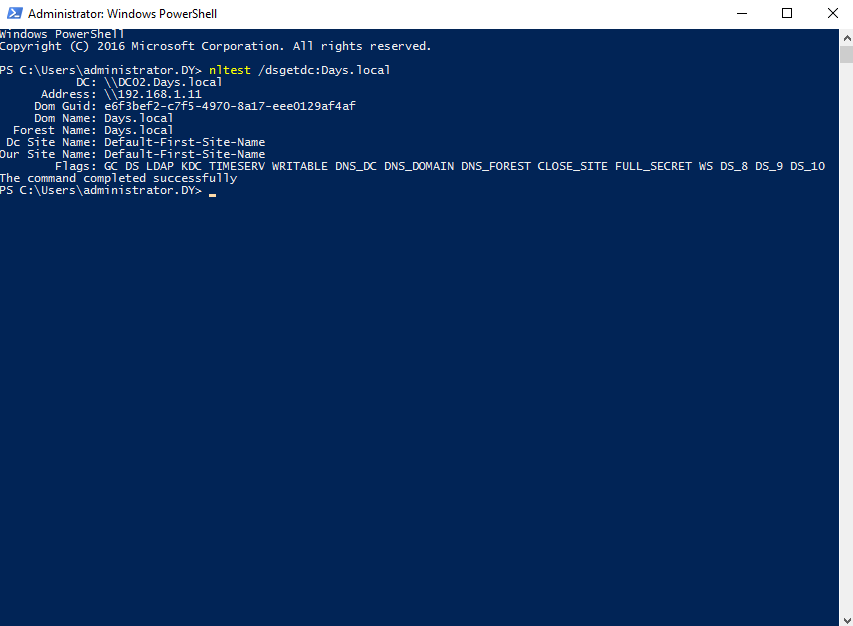

This confirms that DC02 is available for the domain and can be discovered by domain services.

---

## Replication Test Using AD Object

To test replication from the GUI, I created a test user on DC01.

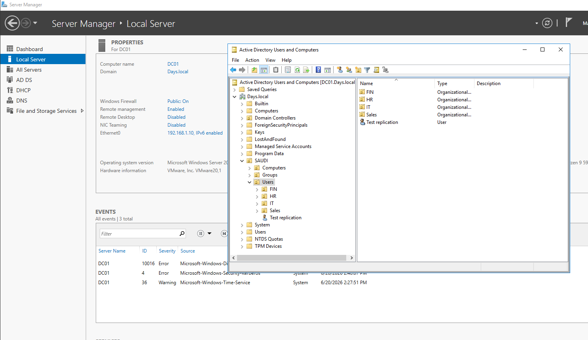

After replication, the same user was visible on DC02.

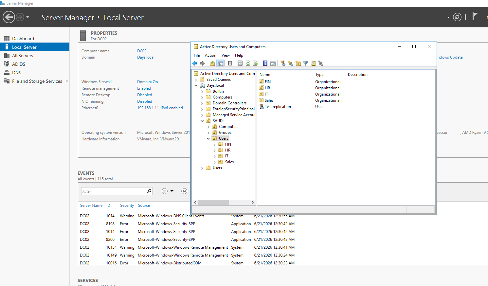

This confirms that Active Directory objects are replicated between DC01 and DC02.

---

## Part 2: DNS Redundancy

After confirming that DC02 was working as an additional Domain Controller and DNS server, I updated the DHCP scope options.

DHCP Option 006 was configured to provide both DNS servers to domain clients:

```text
192.168.1.10
192.168.1.11
```

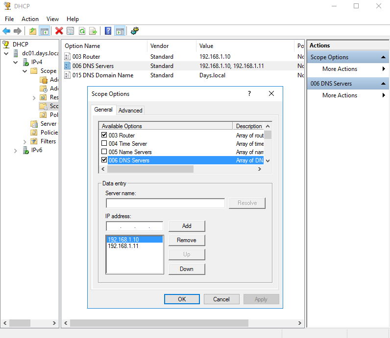

The client received both DNS servers from DHCP.

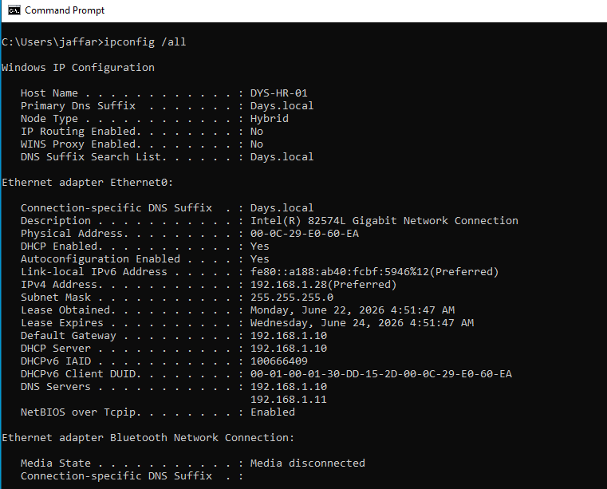

---

## DNS Resolution Test

I tested DNS resolution from the domain client.

The client was able to resolve:

```text
days.local
dc01.days.local
dc02.days.local
```

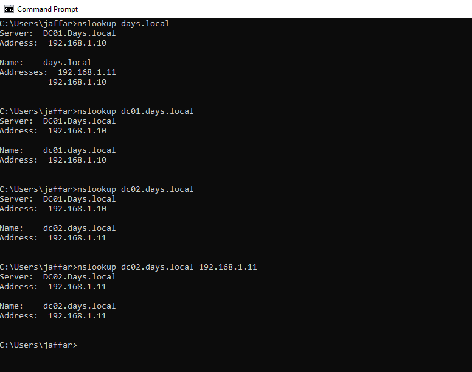

This confirms that DNS resolution is working for the domain and both Domain Controllers.

---

## DNS Failover Test

To test DNS redundancy, I stopped the DNS Server service on DC01.

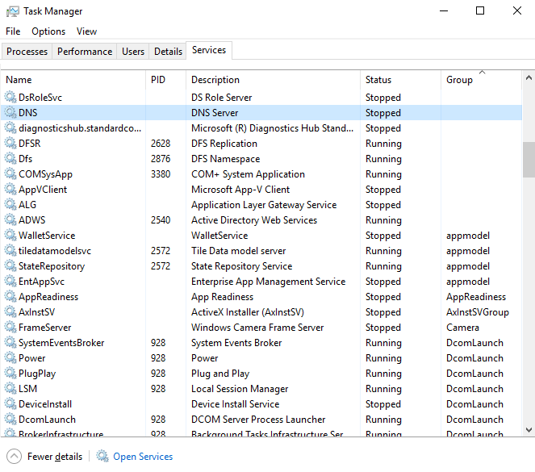

After stopping DNS on DC01, I tested `nslookup` without specifying a DNS server.

The request continued trying the preferred DNS server, which was DC01, and the result timed out.

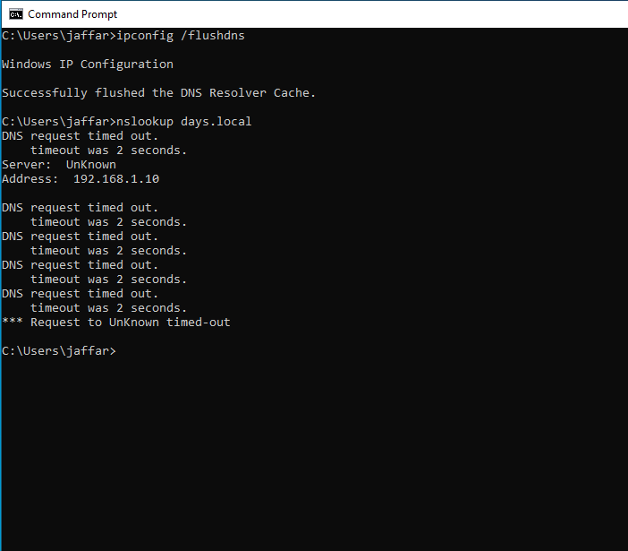

This showed that `nslookup` does not always prove DNS failover automatically, because it may keep using the preferred DNS server first.

To verify DC02 directly, I used this command:

```cmd
nslookup days.local 192.168.1.11
```

The result was successful.

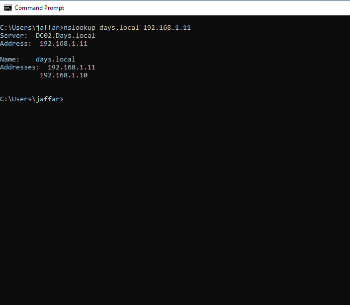

This confirms that DC02 DNS was working and able to resolve the domain directly.

---

## Troubleshooting Note

During the first test, I powered off DC01 completely.

After that, the client received an APIPA address.

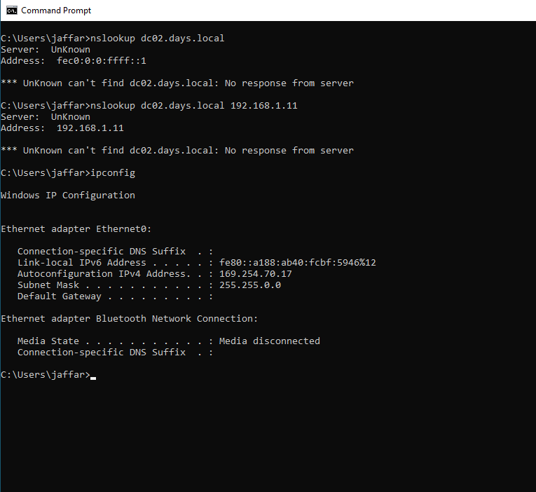

The reason was that DC01 was also providing DHCP and gateway settings in this lab.

So powering off DC01 affected more than DNS only.

To test DNS redundancy correctly, I kept DC01 online and stopped only the DNS Server service.

This helped isolate the DNS test without affecting DHCP and basic network connectivity.

---

## Verification Summary

| Test                                           | Result    |
| ---------------------------------------------- | --------- |
| DC02 promoted as additional Domain Controller  | Passed    |
| DC01 and DC02 visible in Domain Controllers OU | Passed    |
| AD replication using `repadmin /replsummary`   | Passed    |
| Domain Controller discovery using `nltest`     | Passed    |
| Test user replicated between DC01 and DC02     | Passed    |
| DHCP provided two DNS servers to the client    | Passed    |
| DNS resolution using DC01                      | Passed    |
| Direct DNS resolution using DC02               | Passed    |
| Troubleshooting DNS test behavior              | Completed |


---

## Final Result

DC02 was successfully configured as an additional Domain Controller and DNS server.

Active Directory replication was working with 0 failures.

Domain clients received both DNS servers through DHCP.

DC02 was verified as a working DNS server by querying it directly.

The lab successfully improved the domain design by adding Domain Controller replication and DNS redundancy.

