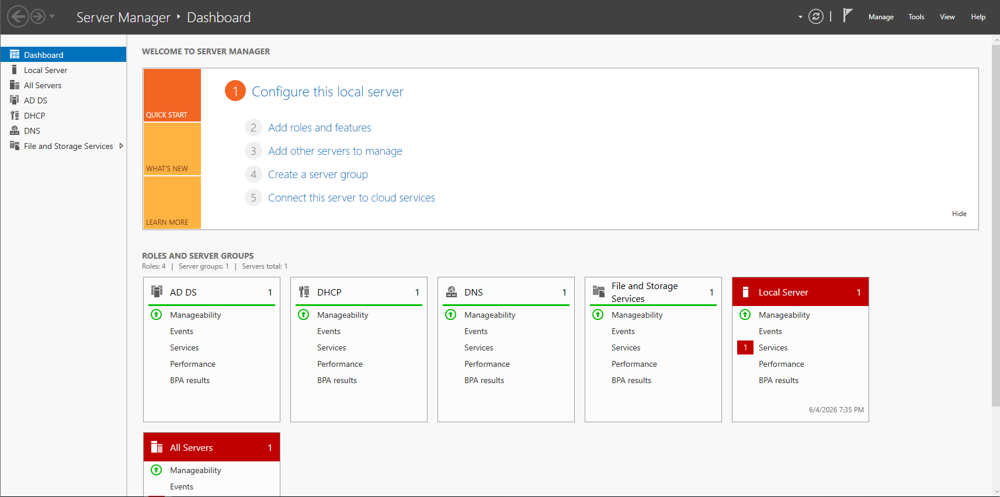
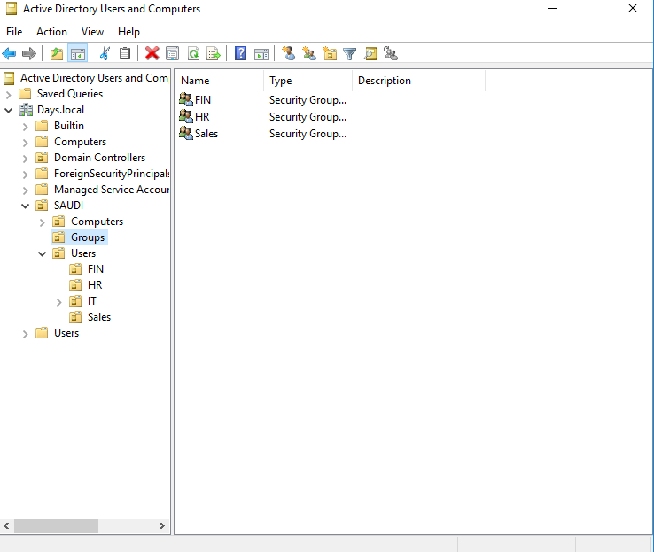
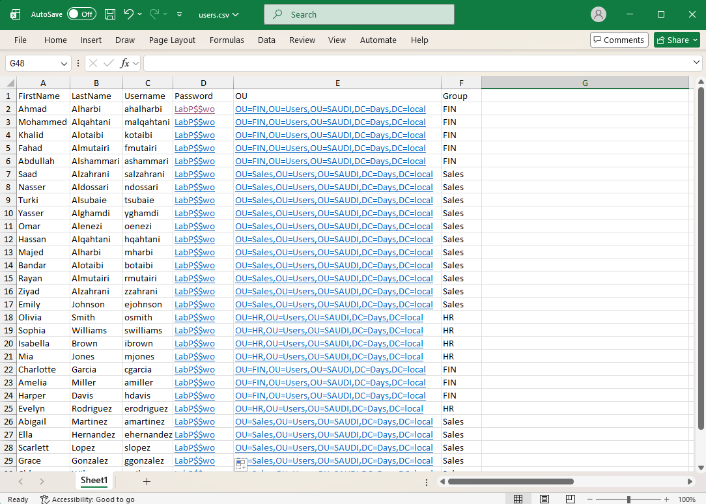
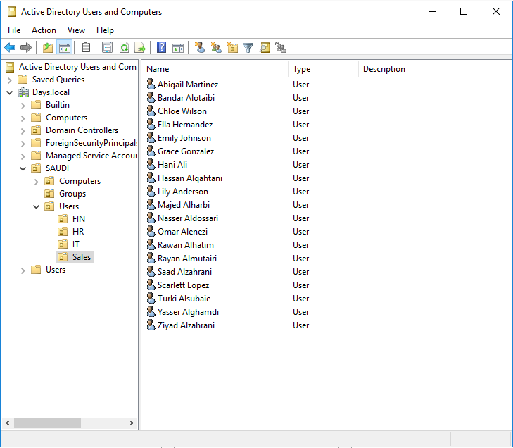
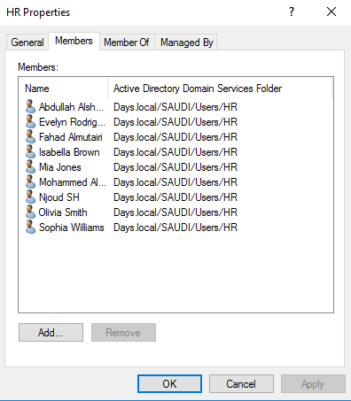
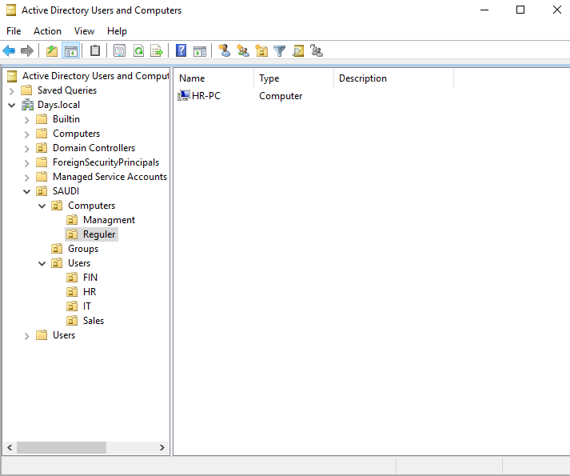
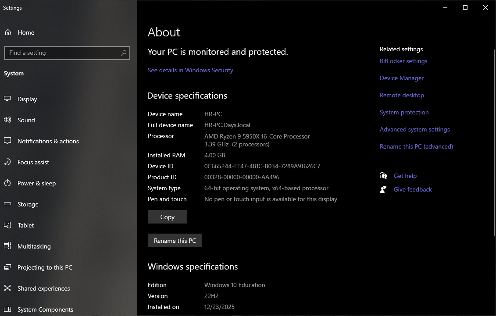
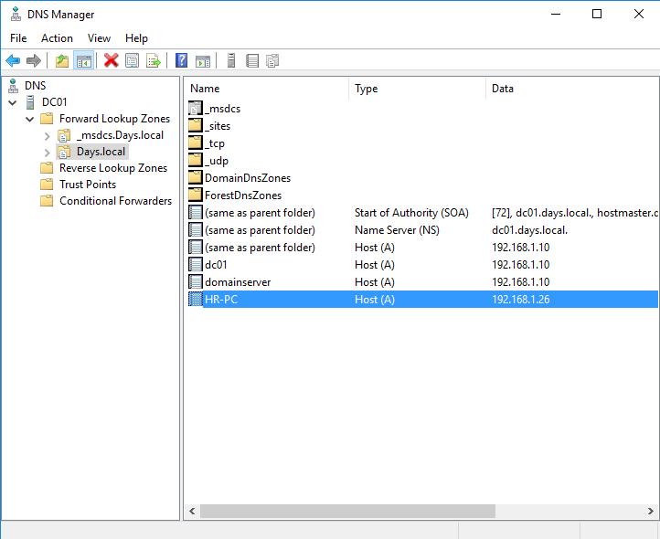
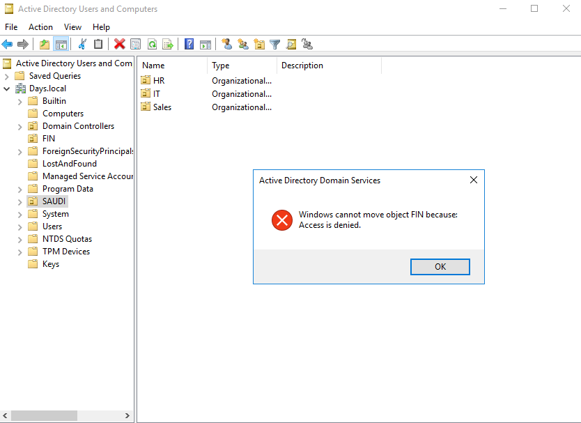

# Active Directory Lab

## Overview

This lab is part of my Windows Server infrastructure home lab.

The goal of this section is to practice basic Active Directory administration, including server roles, organizational units, users, security groups, PowerShell user creation, client domain join, DNS records, and basic troubleshooting.

The lab was built using VMware with a Windows Server domain environment.

---

## Lab Environment

| Component         | Details          |
| ----------------- | ---------------- |
| Virtualization    | VMware           |
| Server            | Windows Server   |
| Domain            | Days.local       |
| Domain Controller | DC01             |
| Client            | Windows 10       |
| Services          | AD DS, DNS, DHCP |

---

## Server Roles Installation

I installed the required Windows Server roles for this lab, including Active Directory Domain Services, DNS, and DHCP.

AD DS is used to manage users, computers, and domain resources. DNS supports name resolution inside the domain, and DHCP provides automatic IP address assignment for client machines.

After installing AD DS, I promoted the server to a Domain Controller and created the domain `Days.local`.



---

## OU Structure and Security Groups

I created a simple Active Directory structure based on departments such as HR, IT, Finance, and Sales.

This structure helps keep Active Directory organized and prepares the environment for applying department-based policies and permissions.

I also created security groups for each department. Using groups makes permission management easier than assigning permissions directly to individual users.



---

## PowerShell Bulk User Creation

I prepared a CSV file containing user information such as first name, last name, username, target OU, and group.

> Passwords shown in this lab are sample values only.



Then, using a PowerShell script, I created multiple Active Directory users and added them to the appropriate security groups.

This approach is useful because it reduces manual work and makes user creation more consistent.

```powershell
Import-Module ActiveDirectory

$Users = Import-Csv "C:\AD-Lab\users.csv"

foreach ($User in $Users) {

    $FullName = "$($User.FirstName) $($User.LastName)"
    $Password = ConvertTo-SecureString $User.Password -AsPlainText -Force

    New-ADUser `
        -Name $FullName `
        -GivenName $User.FirstName `
        -Surname $User.LastName `
        -SamAccountName $User.Username `
        -UserPrincipalName "$($User.Username)@Days.local" `
        -Path $User.OU `
        -AccountPassword $Password `
        -Enabled $true `
        -ChangePasswordAtLogon $true

    Add-ADGroupMember `
        -Identity $User.Group `
        -Members $User.Username
}
```

---

## Users Created in Active Directory

After running the PowerShell script, the users were created successfully inside the correct department OUs.

Each department OU contains its own users, and the users were added to the required security groups.



---

## Security Group Membership

I verified the group membership to make sure users were added to the correct department groups.

This confirms that the users are organized properly and ready to be used later for permissions, file shares, and policy targeting.



---

## Client Domain Join

I joined a Windows client machine to the `Days.local` domain.

After joining the domain, the computer object appeared in Active Directory under the correct computer OU.



I also tested the client from Windows settings to confirm that the machine is connected to the domain.



---

## DNS Records

I reviewed the DNS zone records for the `Days.local` domain.

The DNS records show the Domain Controller and the joined client machine. This is important because Active Directory relies on DNS for clients to locate and communicate with domain services.



---

## Troubleshooting: Access Denied When Moving an OU

During the lab, I faced an issue when trying to move an Organizational Unit. Active Directory returned an `Access is denied` message.

This issue was related to object protection settings in Active Directory.



To investigate the issue, I enabled Advanced Features in Active Directory Users and Computers and checked the Object tab.

After reviewing the object protection setting, I understood how Active Directory can prevent accidental deletion or movement of protected objects.

---

## Skills Practiced

* Windows Server Administration
* Active Directory Domain Services
* DNS and DHCP
* Organizational Units
* Security Groups
* PowerShell Bulk User Creation
* CSV-based User Management
* Client Domain Join
* DNS Records Review
* Basic Active Directory Troubleshooting

---

## Notes

This lab is still part of my learning and practice path. The purpose is to build a better understanding of Windows Server infrastructure and document the steps in a clear and practical way.

Future sections will include Group Policy, File Server, NTFS permissions, mapped drives, backup, and restore testing.

