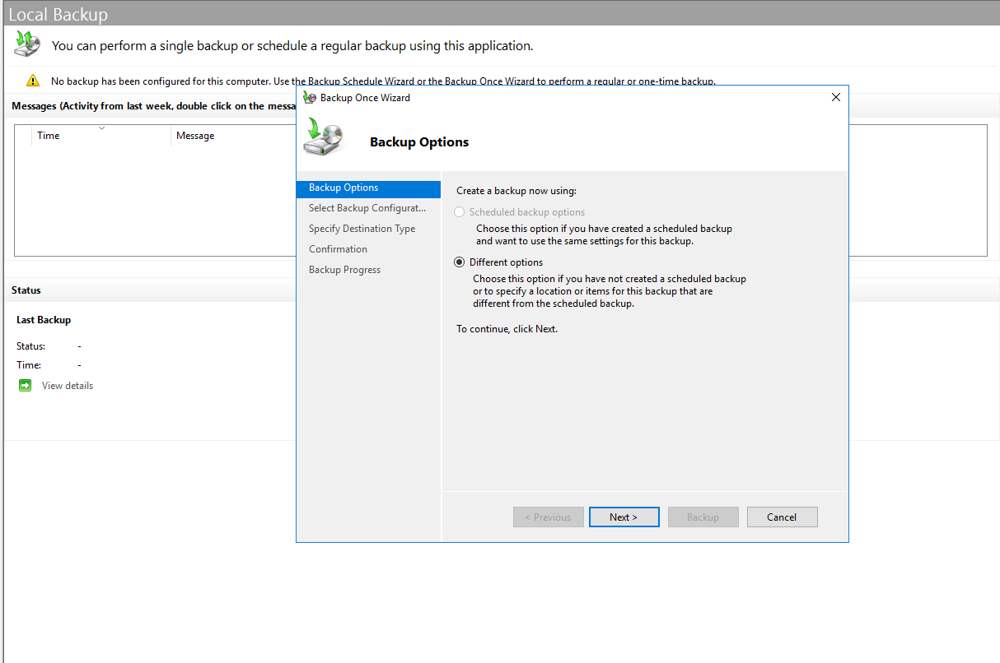
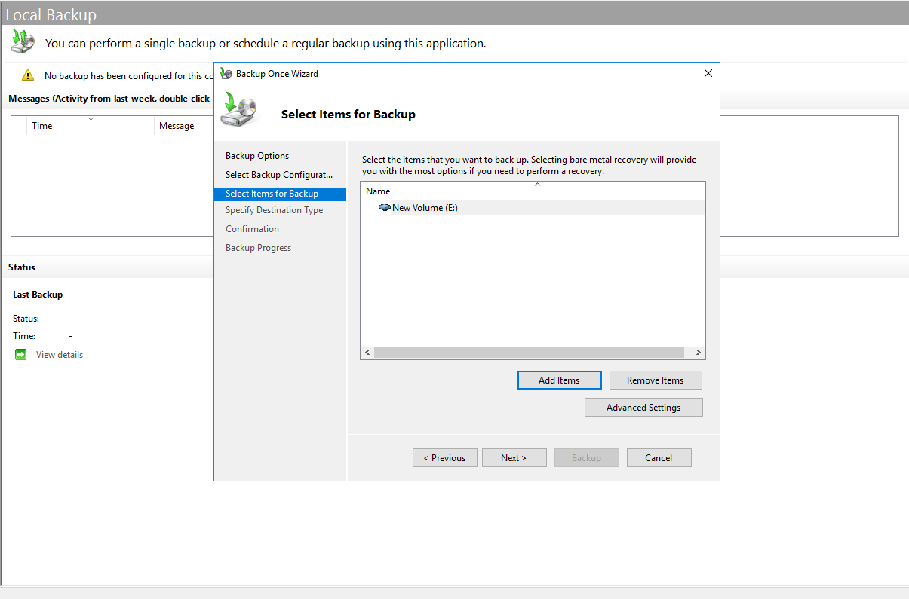
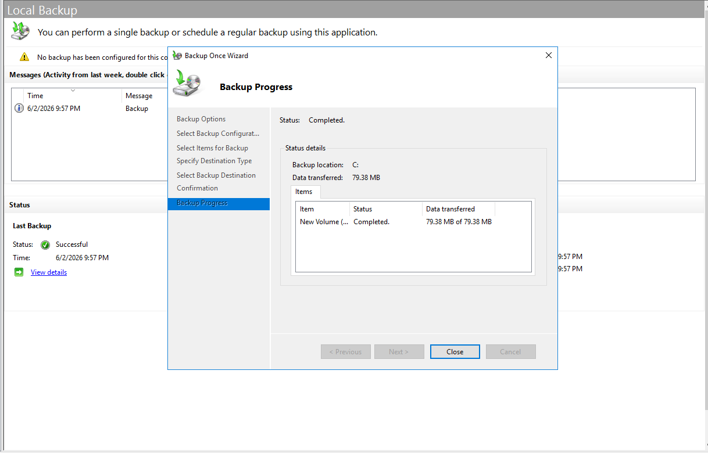
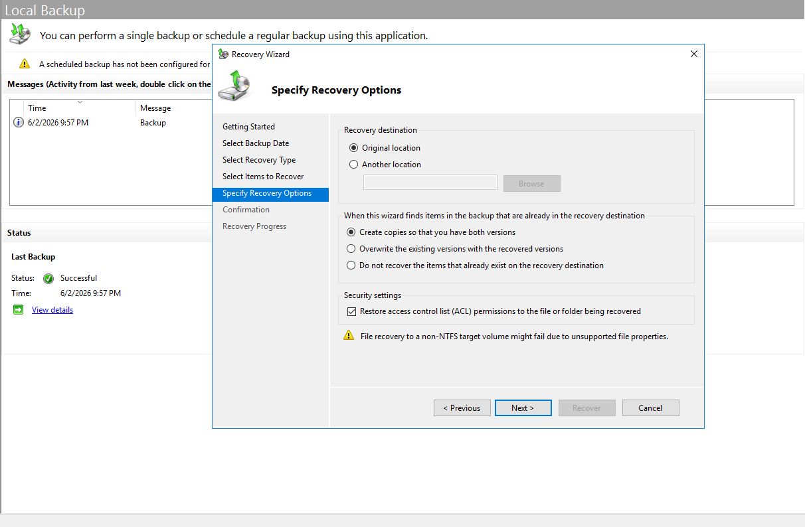
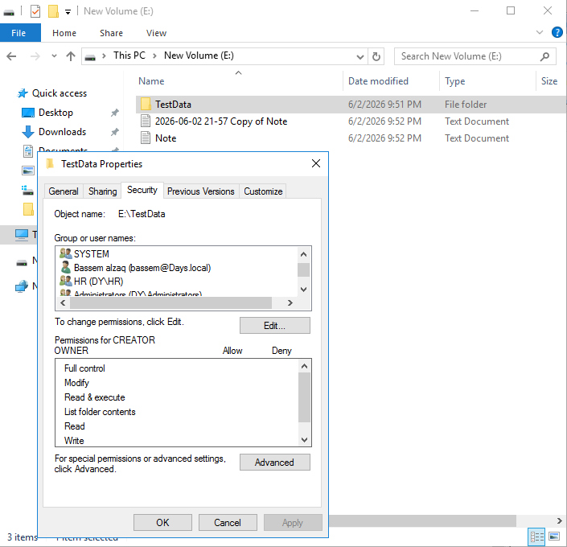
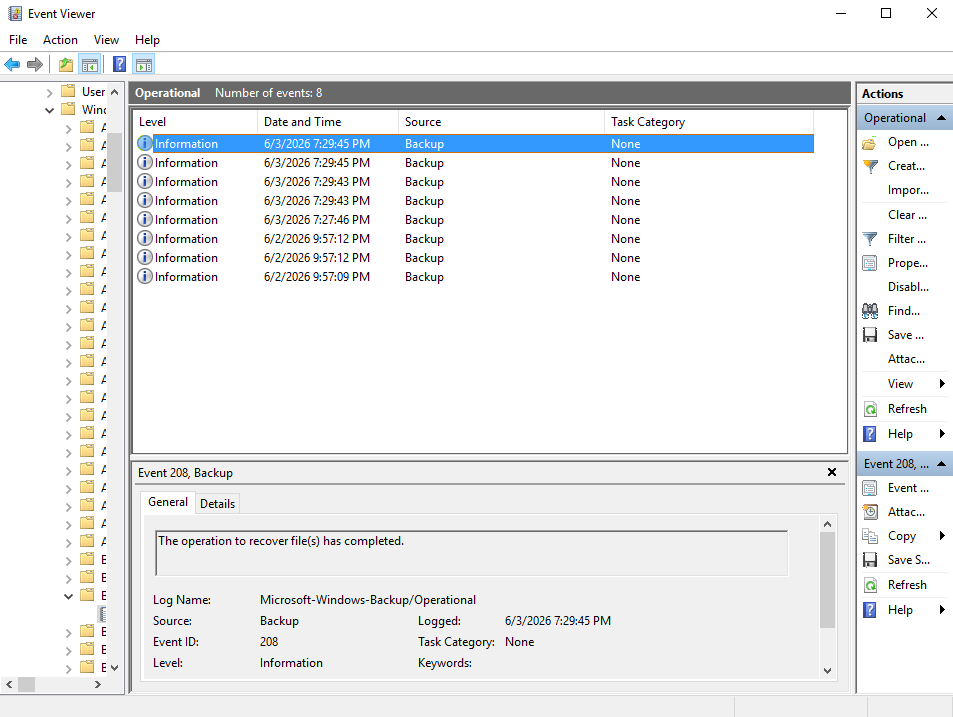

# Backup and Recovery Lab

## Overview

This lab is part of my Windows Server Infrastructure Lab.

In this section, I tested Windows Server Backup by creating a one-time backup and then using the Recovery Wizard to restore files.

The main goal was to verify that the backup is not only completed, but also usable for recovery when files need to be restored.

---

## Lab Environment

| Component     | Details               |
| ------------- | --------------------- |
| Server        | Windows Server        |
| Tool          | Windows Server Backup |
| Backup Type   | Backup Once           |
| Recovery Type | File Recovery         |
| Tested Drive  | New Volume (E:)       |

---

## Backup Once Options

I started the backup using the Backup Once Wizard.

I selected different options because this was a manual backup test and not a scheduled backup.

---

## Select Items for Backup

I selected the data that needed to be included in the backup.

In this lab, I selected `New Volume (E:)` as the backup item.

---

## Backup Completed Successfully

After starting the backup, I verified that the backup process completed successfully.

This confirms that Windows Server Backup was able to create a backup for the selected volume.

---

## Recovery Options

After the backup was completed, I tested the recovery process using the Recovery Wizard.

During the recovery options step, I selected the original location and enabled the option to restore access control list permissions.

This is important because file recovery should restore the data and also keep the correct permissions when needed.

---

## Recovery Completed Successfully

The recovery process completed successfully.

This confirms that the backup could be used to restore the selected files.

---

## Recovered Files Verification

After the recovery, I verified that the restored files were available again on `New Volume (E:)`.

I also checked the folder security tab to confirm that permissions were still available after recovery.

---

## Event Log Verification

I checked Event Viewer to confirm that the recovery operation was recorded by Windows Server Backup.

The event log shows that the file recovery operation was completed.

---

## Skills Practiced

* Windows Server Backup
* Backup Once
* Selecting backup items
* File recovery
* Recovery Wizard
* ACL permission restore
* Backup verification
* Event Viewer verification

---

## Notes

This lab focused on testing the backup and recovery process in a Windows Server environment.

The important part of this test was not only completing the backup, but also verifying that files can be restored successfully.

In a production environment, backup destination planning, backup schedule, retention, and off-server backup storage should also be considered.

