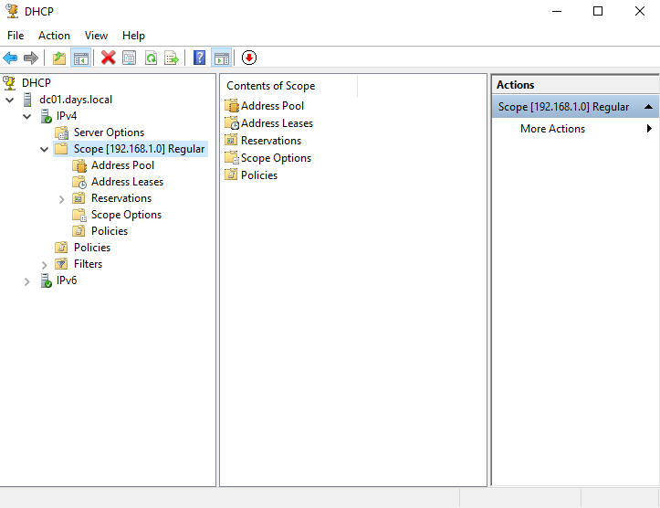
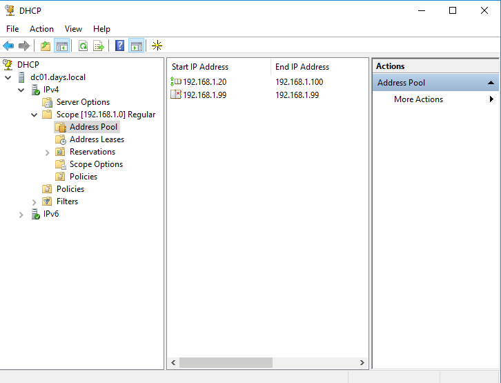
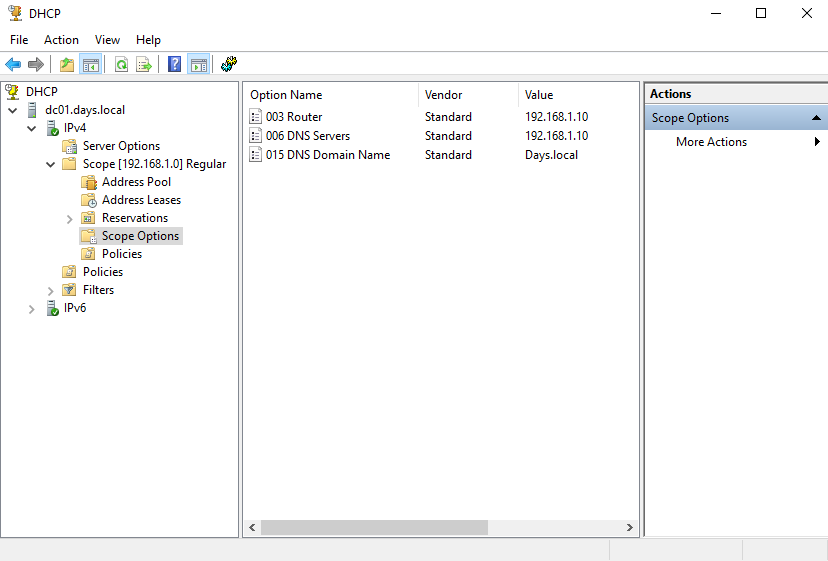
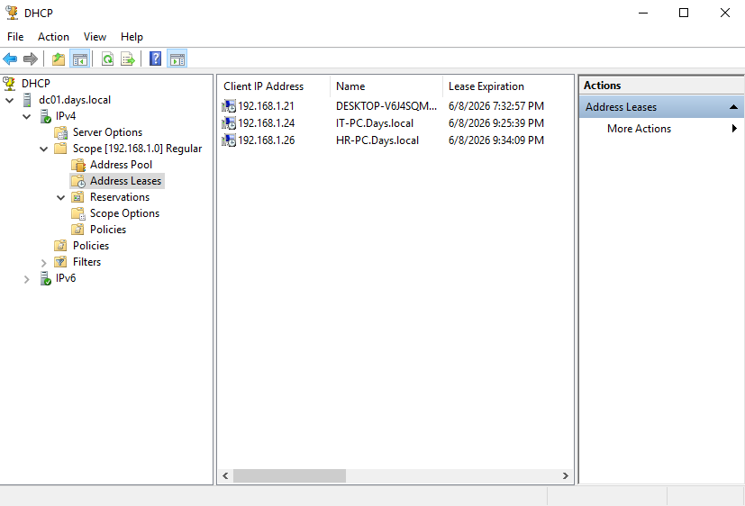
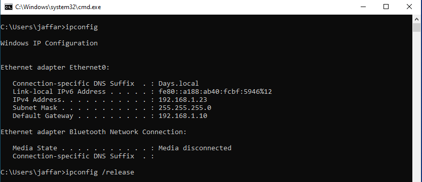
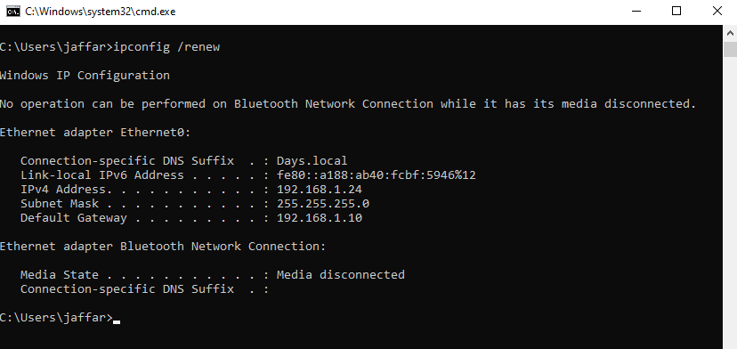
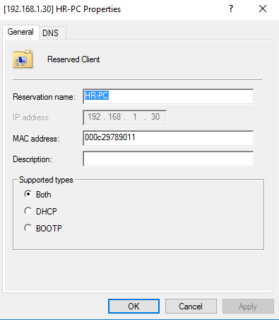
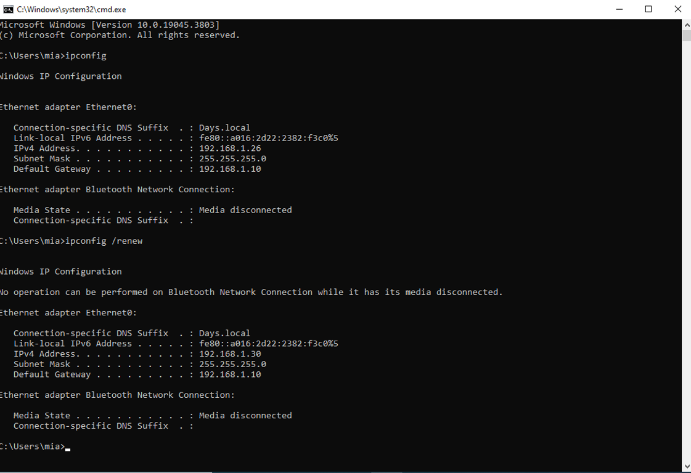

# DHCP Lab

## Overview

This lab is part of my Windows Server Infrastructure Lab.

The goal of this section is to practice DHCP management in a Windows Server domain environment.

In this lab, I reviewed the DHCP scope, address pool, scope options, active leases, and tested IP renewal from client machines. I also configured a DHCP reservation using a client MAC address.

---

## Lab Environment

| Component          | Details                                      |
| ------------------ | -------------------------------------------- |
| Domain             | Days.local                                   |
| DHCP Server        | DC01                                         |
| Scope Network      | 192.168.1.0                                  |
| Address Pool       | 192.168.1.20 - 192.168.1.99                  |
| Scope Options      | Router, DNS Server, DNS Domain Name          |
| Client Machines    | IT-PC, HR-PC                                 |
| Reserved Client    | HR-PC                                        |
| Reserved IP        | 192.168.1.30                                 |
| Tool               | DHCP Console                                 |
| Verification Tools | ipconfig, ipconfig /release, ipconfig /renew |

---

## DHCP Scope Overview

I reviewed the DHCP scope configured on the server.

The scope is used to automatically assign IP addresses to client machines inside the network.



---

## Address Pool

I checked the DHCP address pool.

The address pool defines the range of IP addresses that the DHCP server can assign to client machines.

In this lab, the DHCP scope uses the following range:

```text
192.168.1.20 - 192.168.1.99
```



---

## Scope Options

I reviewed the DHCP scope options.

These options are important because DHCP does not only assign an IP address. It can also provide the client with network settings such as the default gateway, DNS server, and domain name.

The configured options include:

* Router: `192.168.1.10`
* DNS Server: `192.168.1.10`
* DNS Domain Name: `Days.local`



---

## Address Leases

I checked the active DHCP leases from the DHCP console.

This shows the client machines that received IP addresses from the DHCP server.

In this lab, the DHCP server assigned IP addresses to multiple client machines, including IT-PC and HR-PC.



---

## Client IP Before Renew

On the client machine, I checked the current IP configuration using `ipconfig`.

The client had an IP address assigned from the DHCP scope.



---

## Client IP Renew Test

I tested DHCP renewal on the client machine using:

```cmd
ipconfig /release
ipconfig /renew
```

After renewing the IP configuration, the client received an IP address from the DHCP server successfully.



---

## DHCP Reservation

I created a DHCP reservation for HR-PC using the client MAC address.

The purpose of the reservation is to make sure the same client receives a specific IP address from DHCP.

In this lab, I reserved the following IP address for HR-PC:

```text
192.168.1.30
```



---

## Reservation Verification

Before creating the reservation, HR-PC received an IP address automatically from the DHCP scope.

After creating the reservation and renewing the IP configuration, HR-PC received the reserved IP address successfully:

```text
192.168.1.30
```

This confirms that the DHCP reservation is working correctly.



---

## Skills Practiced

* DHCP Console
* DHCP scope review
* Address pool verification
* Scope options review
* DHCP leases
* IP release and renew
* DHCP reservation using MAC address
* Client-side DHCP verification

---

## Notes

This lab focused on basic DHCP management and client IP assignment in a Windows Server domain environment.

The important part of this test was verifying DHCP from both sides: the DHCP server console and the client machine.

I also tested DHCP reservation to make sure a specific client can receive a fixed IP address from the DHCP server.

Future improvements may include DHCP exclusions, DHCP failover, multiple scopes, and DHCP troubleshooting.

