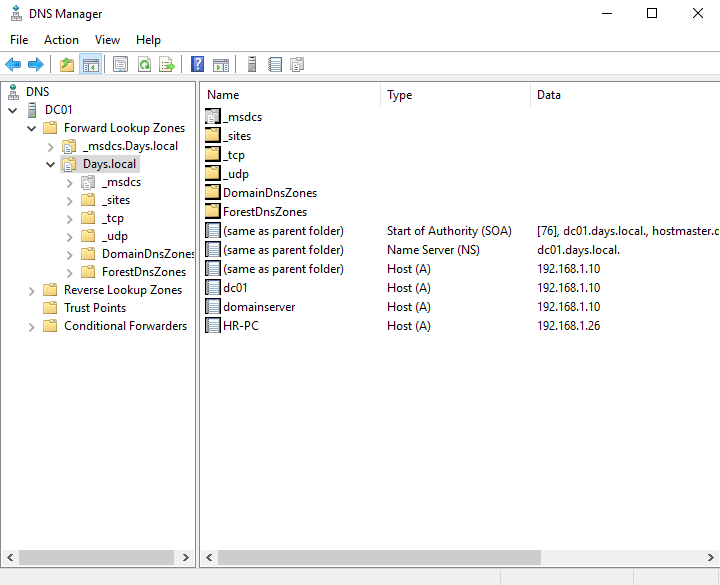
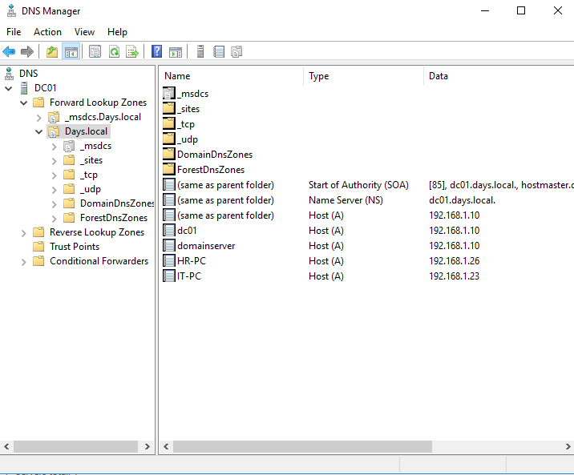
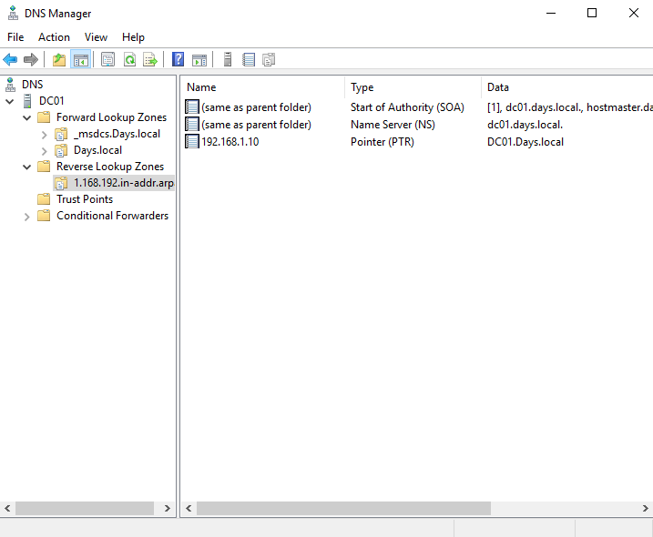
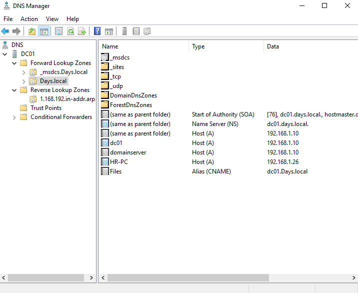
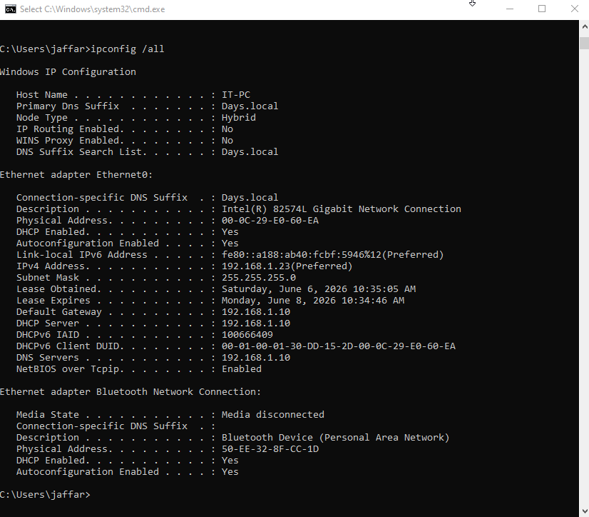
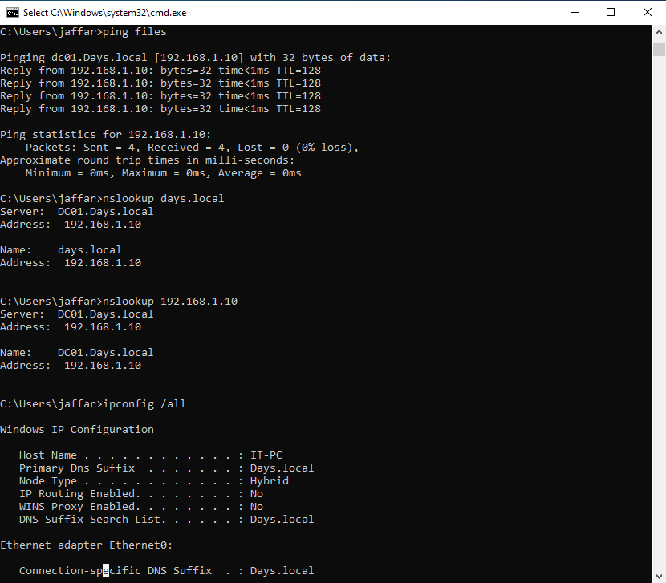
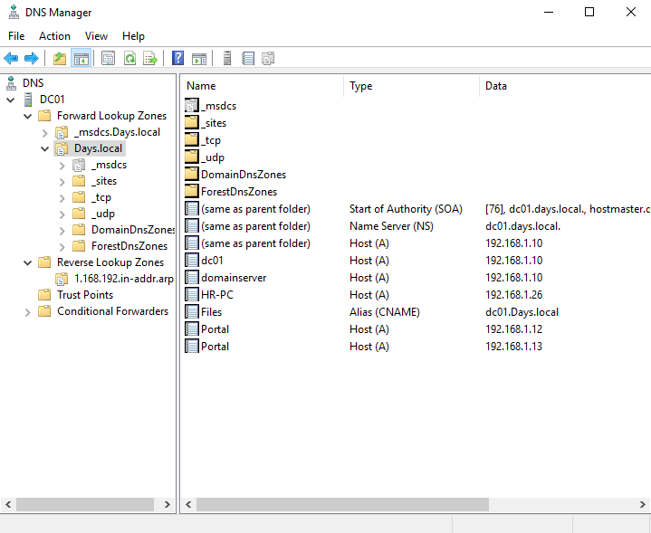
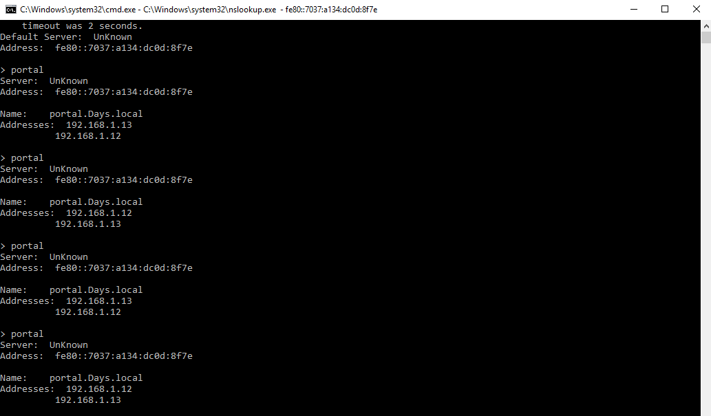
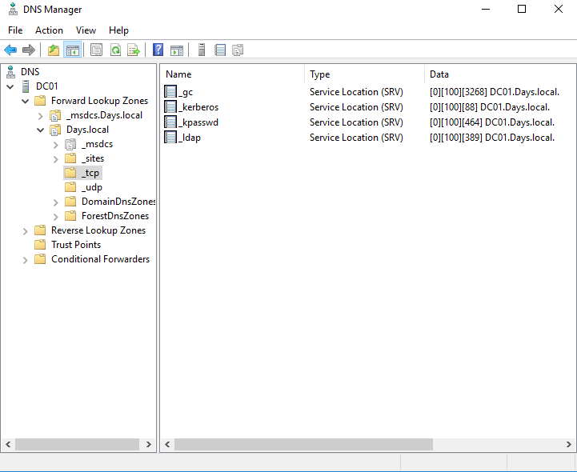

# DNS Lab

## Overview

This lab is part of my Windows Server Infrastructure Lab.

The goal of this section is to practice DNS management in a Windows Server domain environment.

In this lab, I worked with forward lookup records, reverse lookup records, CNAME alias records, and AD-related SRV records. I also tested name resolution from a domain-joined client machine.

---

## Lab Environment

| Component | Details |
|---|---|
| Domain | Days.local |
| DNS Server | DC01 |
| Domain Controller | DC01 |
| Client Machine | IT-PC |
| DNS Zone | Days.local |
| Reverse Zone | 1.168.192.in-addr.arpa |
| Tool | DNS Manager |
| Verification Tools | nslookup, ping, ipconfig |

---

## Forward Lookup Zone

I reviewed the forward lookup zone for the domain `Days.local`.

The forward lookup zone is used to resolve hostnames to IP addresses.

In this lab, the zone includes records for the domain controller and client machines.



---

## Client Host Records

I verified that client machines appeared in the DNS forward lookup zone.

This confirms that DNS records are available for domain-joined client machines.



---

## Reverse Lookup and PTR Record

I configured a reverse lookup zone and created a PTR record for the domain controller.

The PTR record allows DNS to resolve an IP address back to a hostname.

In this lab, the PTR record resolves:

```text
192.168.1.10 → DC01.Days.local
```



---

## CNAME Alias Record

I created a CNAME alias called `Files`.

The alias points to the domain controller:

```text
Files.Days.local → DC01.Days.local
```

This allows the server to be reached using a service-friendly name instead of only using the server hostname.



---

## Client DNS Settings

On the client machine, I checked the DNS configuration using `ipconfig /all`.

The client machine is using the domain DNS server `192.168.1.10`.

This is important because domain-joined clients should use the internal DNS server to resolve domain resources correctly.



---

## DNS Resolution Tests

I tested DNS resolution from the client machine using `ping` and `nslookup`.

The client was able to resolve the domain name and reverse lookup record successfully.



---

## Multiple A Records Test

I created multiple A records for `Portal`.

The purpose of this test was to see how DNS returns more than one IP address for the same hostname.

This is a DNS round-robin style test, not a full load balancing solution.



---

## Multiple A Records Verification

I tested the `Portal` hostname using `nslookup`.

The result showed multiple IP addresses for the same DNS name.



---

## AD SRV Records

I reviewed the AD-related SRV records under the domain DNS zone.

These records are used by domain clients to locate Active Directory services such as LDAP and Kerberos.



---

## Skills Practiced

* DNS Manager
* Forward Lookup Zone
* Host A records
* Reverse Lookup Zone
* PTR records
* CNAME alias records
* Multiple A records
* AD SRV records review
* nslookup testing
* DNS client configuration verification

---

## Notes

This lab focused on DNS configuration and testing inside a Windows Server domain environment.

The main goal was to verify that the DNS server can resolve domain names, reverse lookup records, aliases, and AD service records correctly.

Future improvements may include DNS troubleshooting, conditional forwarders, DNS scavenging, and integration with DHCP.

