# Advanced File Server Features

## Overview

This lab builds on the previous File Server lab.

In the first File Server lab, the shared folder was hosted on `DC01`.

In this upgrade, the File Server role was moved to a dedicated server named `FS01`.

The goal was to separate file services from the Domain Controller and add advanced File Server features that are closer to a real infrastructure environment.

---

## Lab Environment

| Server / Client | Role                              | Details                 |
| --------------- | --------------------------------- | ----------------------- |
| DC01            | Domain Controller, DNS, DHCP      | Main domain services    |
| DC02            | Additional Domain Controller, DNS | AD and DNS redundancy   |
| FS01            | Dedicated File Server             | Hosts the company share |
| DYS-HR-01       | Domain Client                     | Used for access testing |

Domain:

```text
Days.local
```

Main shared path:

```text
\\FS01\Company
```

---

# Part 1: FS01 Role Separation and Baseline Verification

## FS01 Dedicated File Server

FS01 was joined to the `Days.local` domain and configured with the IP address `192.168.1.12`.

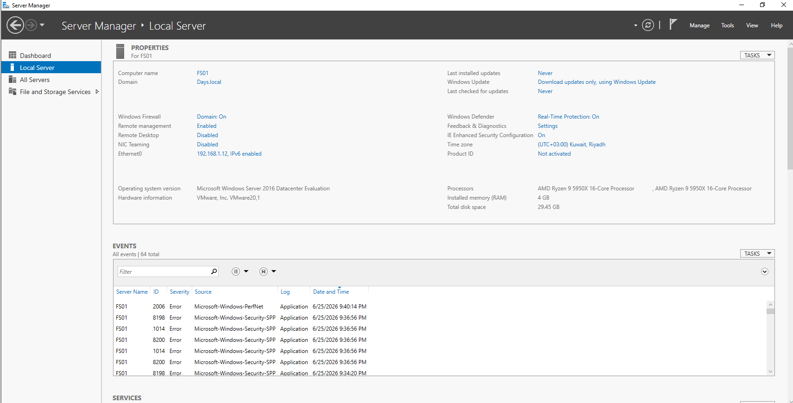

The purpose of this step was to move the File Server role away from the Domain Controller.

This makes the design better because the Domain Controller should focus on Active Directory, DNS, and authentication, while the File Server handles shared folders and file access.

---

## Company Folder Structure

The main company folder was created on `FS01`.

Inside the company folder, department folders were created for HR, Finance, IT, and Sales.

```text
D:\Company
├── HR
├── Finance
├── IT
└── Sales
```


---

## Company Share

The `Company` folder was shared from `FS01`.

Users can access the share using this network path:

```text
\\FS01\Company
```


---

## NTFS Permissions

NTFS permissions were configured using security groups.

Each department folder was assigned to its related File Server group.

For example:

```text
HR folder       → FS-HR-Modify
Finance folder  → FS-FIN-Modify
```


---

## Access Verification

Access was tested using an HR user.

The HR user was not able to access the Finance folder.


This confirms that access is controlled by NTFS permissions and security group membership.

---

## GPO Drive Mapping

The company share was mapped to users using Group Policy Drive Maps.

The mapped drive was configured as:

```text
H: → \\FS01\Company
```


The policy was verified using:

```cmd
gpresult /r
```

The result showed that `Map-Company-Drive` was applied successfully.


The mapped drive appeared on the client machine as `Company Share (H:)`.


---

## Part 1 Result

FS01 is working as a dedicated File Server.

The company share is available through `\\FS01\Company`.

Users receive the mapped drive through Group Policy.

Access is controlled by NTFS permissions and security groups.

---

# Part 2: Advanced File Server Features

## Access-Based Enumeration

Access-Based Enumeration was enabled on the `Company` share.

The goal was to hide folders that the user does not have permission to access.

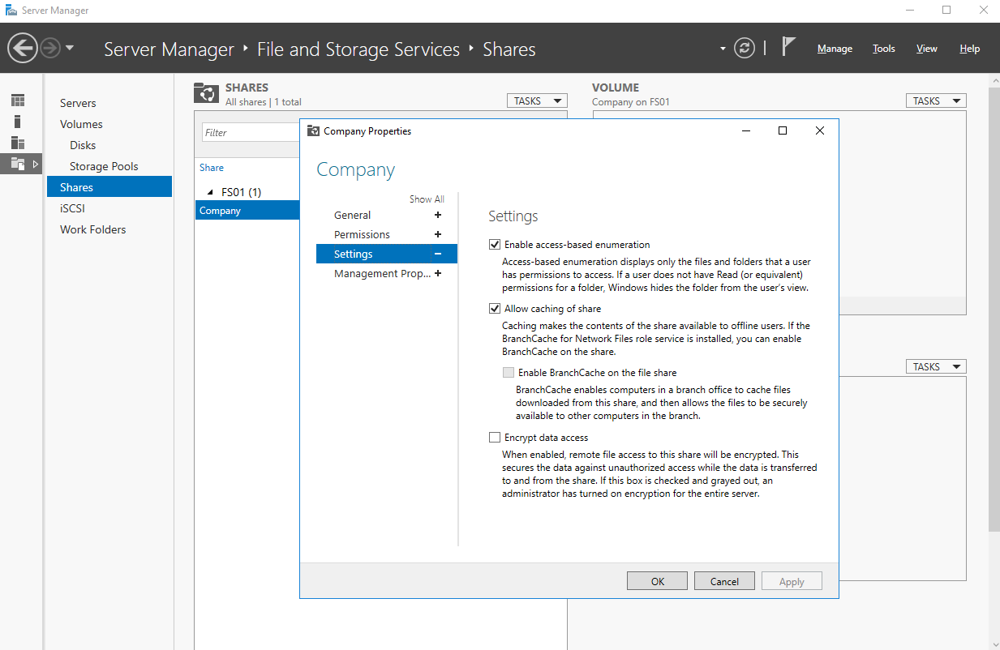

After enabling Access-Based Enumeration, the HR user could only see the HR folder.

Unauthorized folders like Finance, IT, and Sales were hidden from the user view.

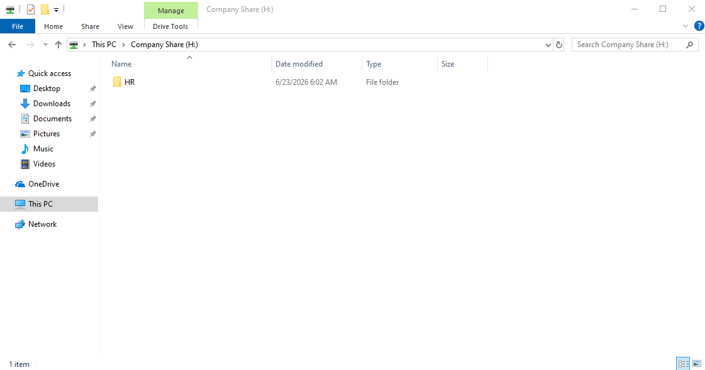

This improves the user experience and reduces visibility of folders that users should not access.

---

## FSRM Auto Apply Quota

File Server Resource Manager was used to apply quota limits to department folders.

Auto Apply Quota was configured on:

```text
D:\Company
```

This created separate quotas for each department folder.

Each department folder was limited to 50 MB for testing.

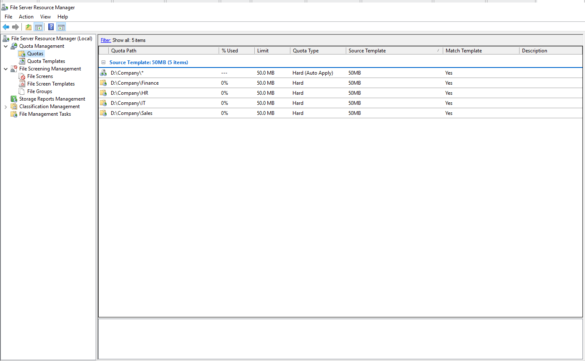

The quota was tested by trying to copy a large file into the HR folder.

The operation failed because the folder exceeded the quota limit.

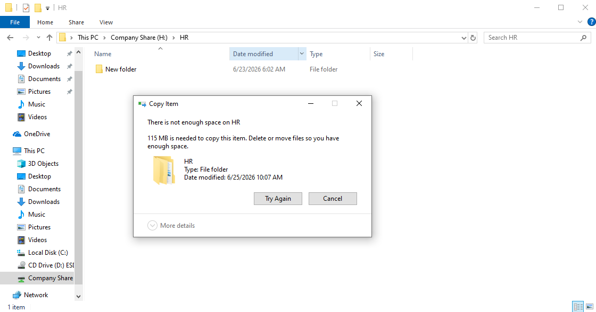

This confirms that FSRM can control storage usage for each department folder.

---

## File Screening

File Screening was configured using File Server Resource Manager.

The goal was to block unwanted file types from being saved inside the company share.

Active screening was used, which means blocked file types are denied immediately.

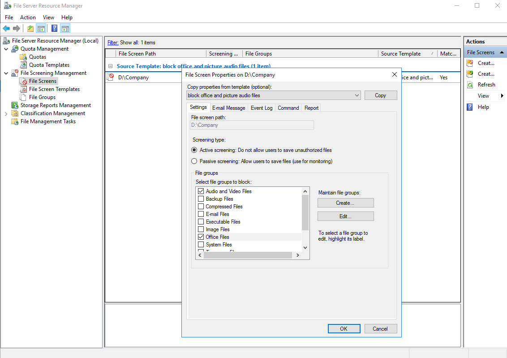

The test confirmed that the user could not save a blocked file type inside the HR folder.

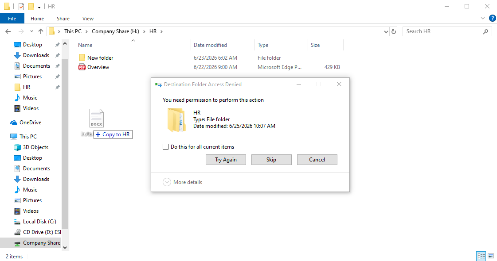

This confirms that File Screening can control file types even when the user has Modify permission on the folder.

---

## Shadow Copies / Previous Versions

Shadow Copies were enabled on the `D:` drive.

The goal was to allow users or administrators to restore previous versions of files without doing a full backup restore.

A schedule was configured for Shadow Copies.

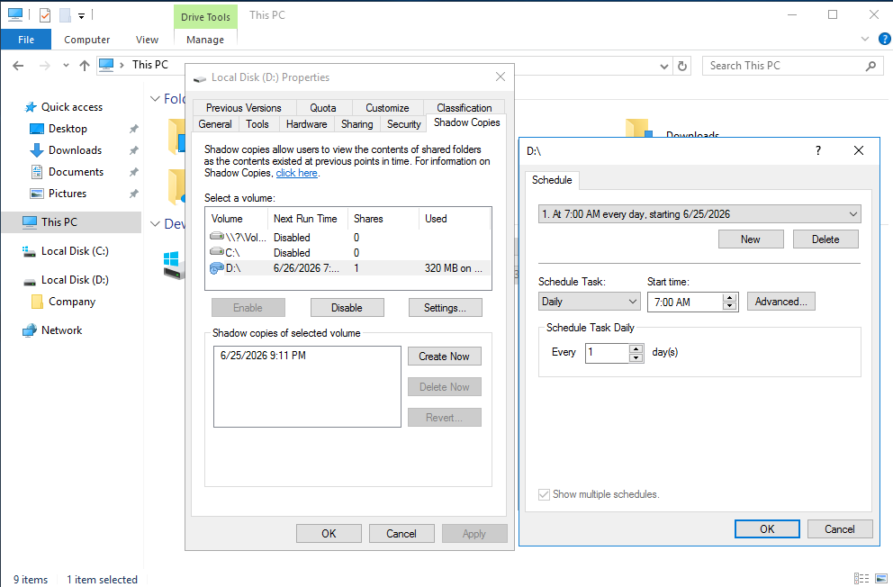

Previous Versions were tested by restoring an earlier version of the HR folder.

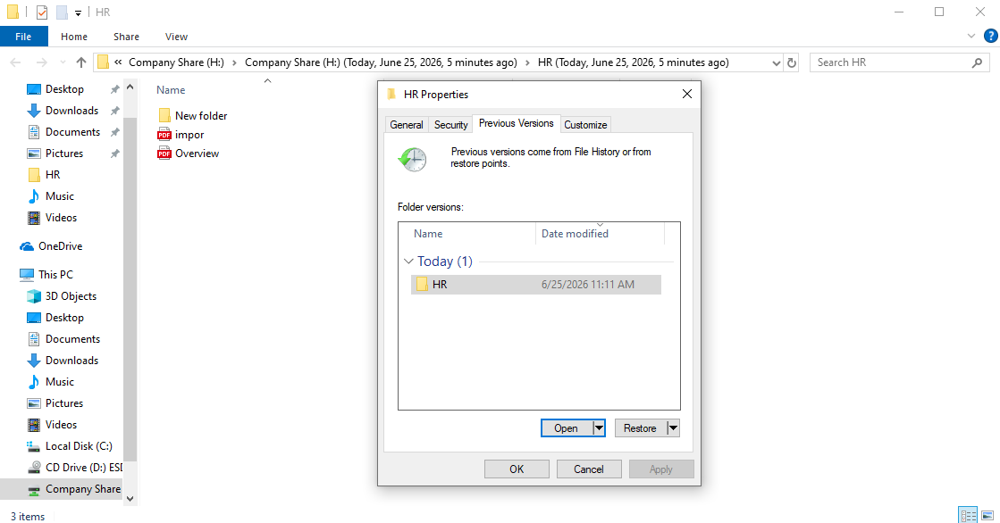

This confirms that previous versions can be used to recover files after changes or accidental deletion.

---

## File Auditing

File auditing was configured to track file activity inside the company share.

The audit policy was configured using Group Policy and applied to the File Servers OU.

The policy enabled Audit File System for Success and Failure events.

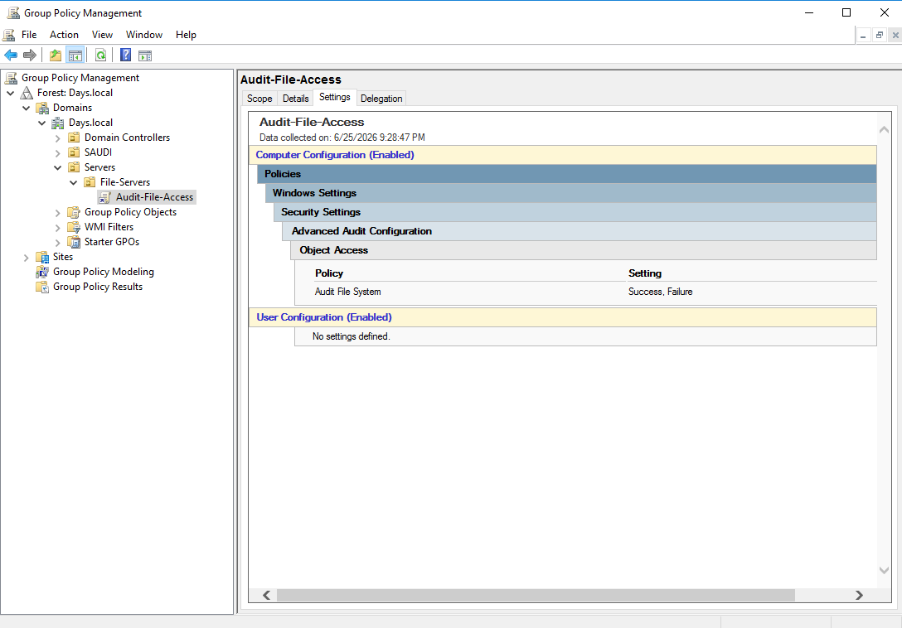

Auditing was then enabled on the `D:\Company` folder.

The audit entry was configured to track actions such as creating files, writing data, and deleting files.

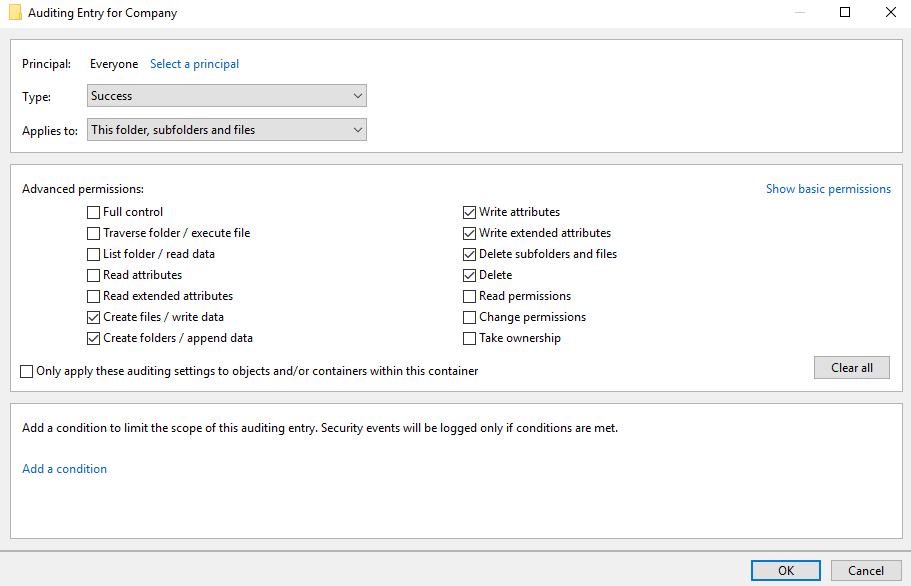

A test file was deleted by a domain user, and the event was recorded in Event Viewer.

The Security log showed Event ID `4663`, including the user account, file path, and access type.

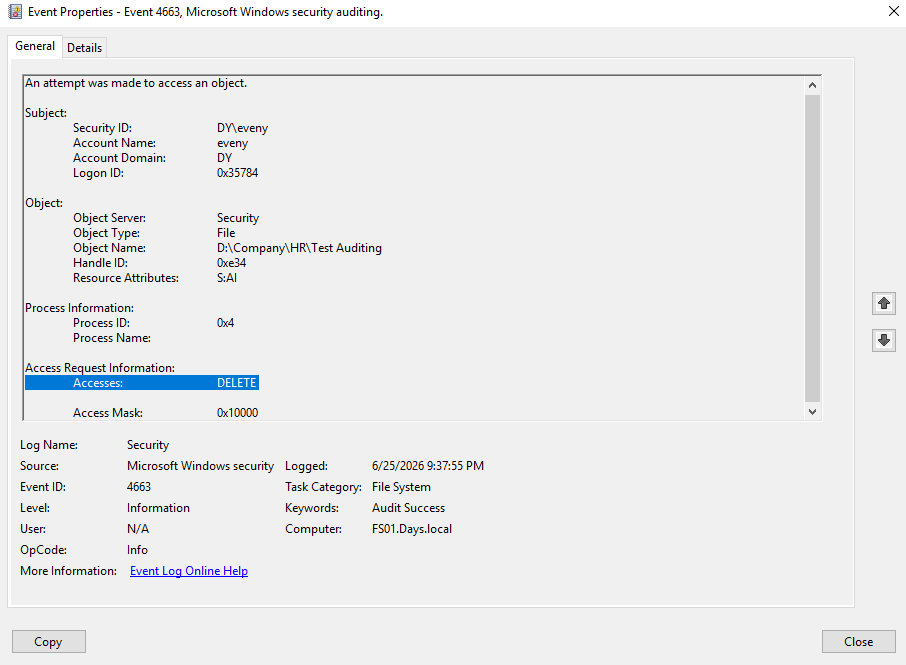

This confirms that file auditing can be used to identify who accessed or deleted files.

---

## Troubleshooting Note

During the NTFS permission test, the HR user was able to create a folder inside the Finance folder.

After checking Effective Access and using `icacls`, the issue was found to be inherited special permissions from the `D:\` drive.

The inherited permission was assigned to `BUILTIN\Users` and allowed users to create files and folders.

To fix the issue, inheritance was disabled on the Finance folder and the inherited `BUILTIN\Users` permissions were removed.

After that, the HR user could no longer access the Finance folder, while Finance users still had Modify access through the `FS-FIN-Modify` group.

---

## Verification Summary

| Feature                                | Result |
| -------------------------------------- | ------ |
| FS01 dedicated File Server             | Passed |
| Company share created                  | Passed |
| NTFS permissions using security groups | Passed |
| HR user denied access to Finance       | Passed |
| GPO mapped drive                       | Passed |
| Access-Based Enumeration               | Passed |
| FSRM Auto Apply Quota                  | Passed |
| File Screening                         | Passed |
| Shadow Copies / Previous Versions      | Passed |
| File Auditing with Event Viewer        | Passed |

---

## Technical Summary

This lab upgraded the File Server design by moving shared folders from the Domain Controller to a dedicated File Server named `FS01`.

The environment now uses a separated File Server role, group-based NTFS permissions, GPO drive mapping, Access-Based Enumeration, FSRM quotas, File Screening, Shadow Copies, and File Auditing.

The final design provides better role separation, controlled folder visibility, storage limits, file type restrictions, file recovery options, and audit tracking for file activity.

---

## Final Result

FS01 was successfully configured as a dedicated File Server for the `Days.local` domain.

The `Company` share is available through:

```text
\\FS01\Company
```

Users receive the mapped drive through Group Policy as:

```text
H: → \\FS01\Company
```

Access is controlled using NTFS permissions and department security groups.

Advanced File Server features were configured and verified, including Access-Based Enumeration, FSRM quotas, File Screening, Shadow Copies, and File Auditing.
