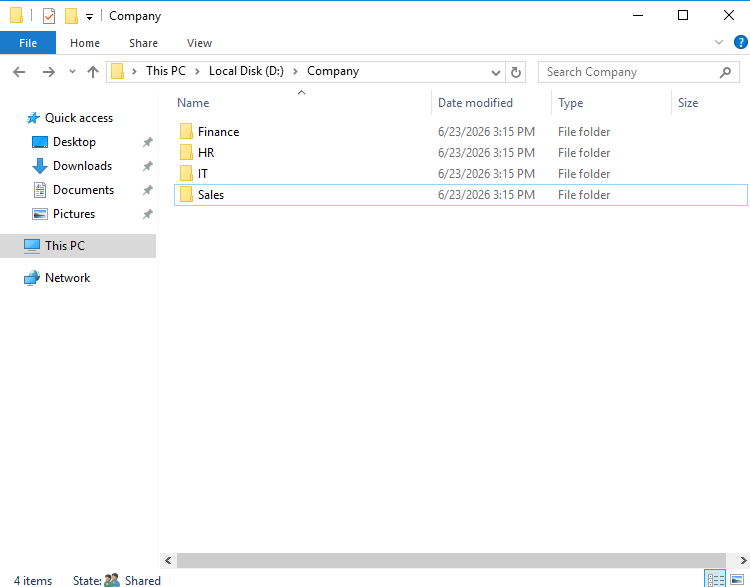
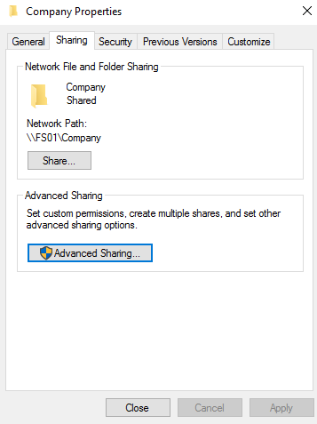
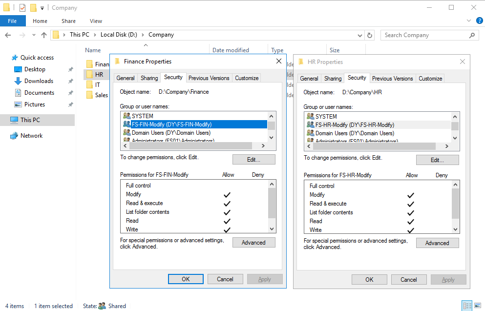
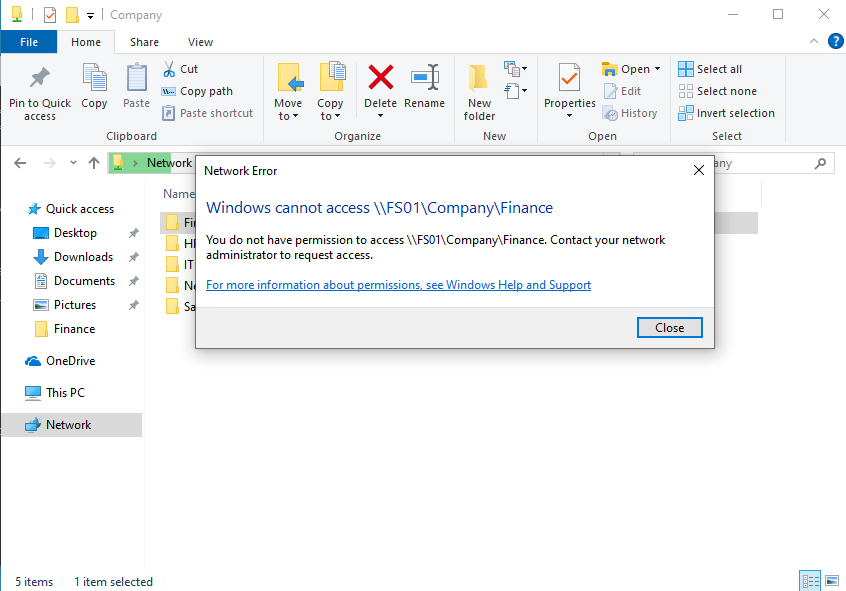
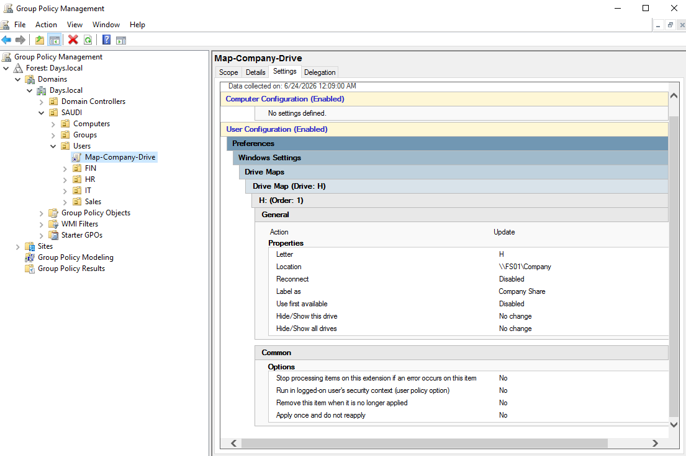
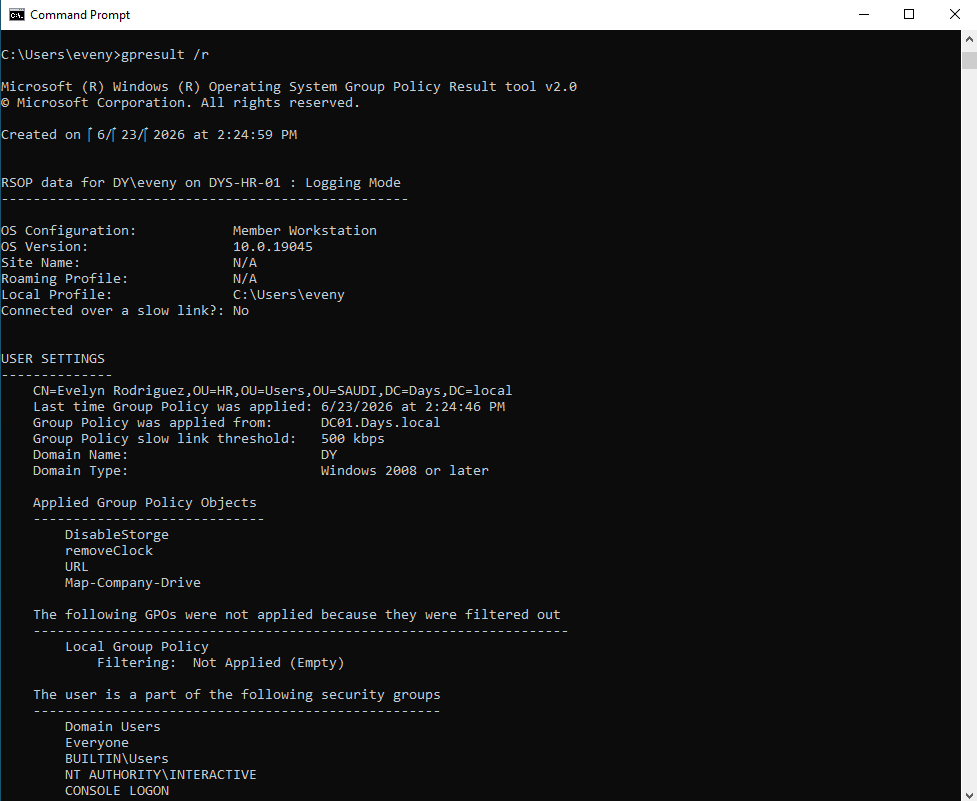
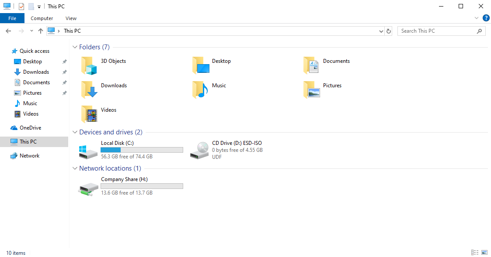

## Part 1: FS01 Role Separation and Baseline Verification

In the previous File Server lab, the shared folder was hosted on `DC01`.

In this upgrade, I moved the File Server role to a dedicated server named `FS01`.

The goal was to separate file services from the Domain Controller and make the design closer to a real infrastructure environment.

The new shared path is:

```text
\\FS01\Company
```

---

### Company Folder Structure

The main company folder was created on `FS01`.

Inside the company folder, I created department folders for HR, Finance, IT, and Sales.

```text
D:\Company
├── HR
├── Finance
├── IT
└── Sales
```



---

### Company Share

The `Company` folder was shared from `FS01`.

Users can access the share using this network path:

```text
\\FS01\Company
```



---

### NTFS Permissions

NTFS permissions were configured using security groups.

Each department folder was assigned to its related File Server group.

For example:

```text
HR folder      → FS-HR-Modify
Finance folder → FS-FIN-Modify
```



---

### Access Verification

Access was tested using an HR user.

The HR user was not able to access the Finance folder.



This confirms that access is controlled by NTFS permissions and security group membership.

---

### GPO Drive Mapping

The company share was mapped to users using Group Policy Drive Maps.

The mapped drive was configured as:

```text
H: → \\FS01\Company
```



The policy was verified using:

```cmd
gpresult /r
```

The result showed that `Map-Company-Drive` was applied successfully.



The mapped drive appeared on the client machine as `Company Share (H:)`.



---

### Part 1 Result

FS01 is now working as a dedicated File Server.

The company share is available through `\\FS01\Company`.

Users receive the mapped drive through Group Policy.

Access is still controlled by NTFS permissions and security groups.
