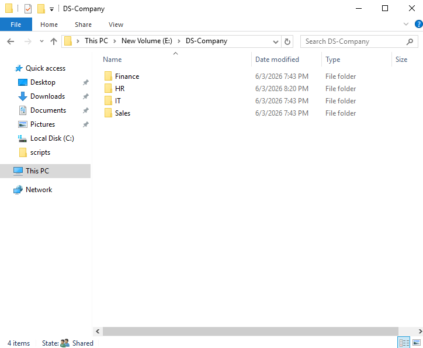
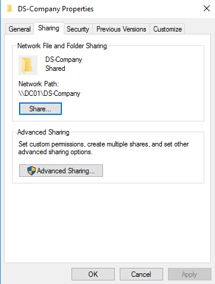
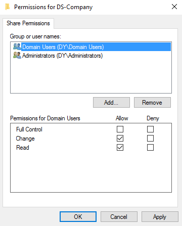
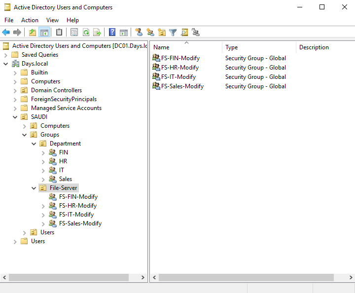
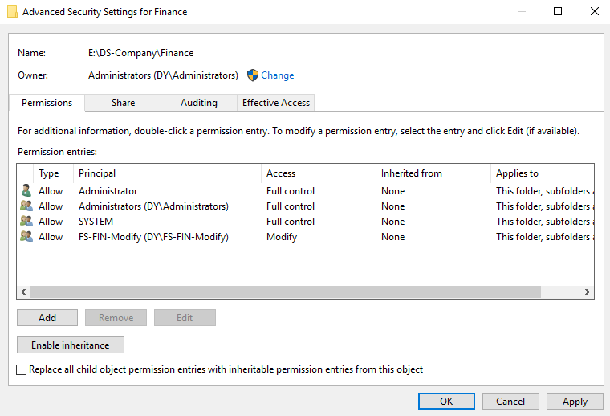
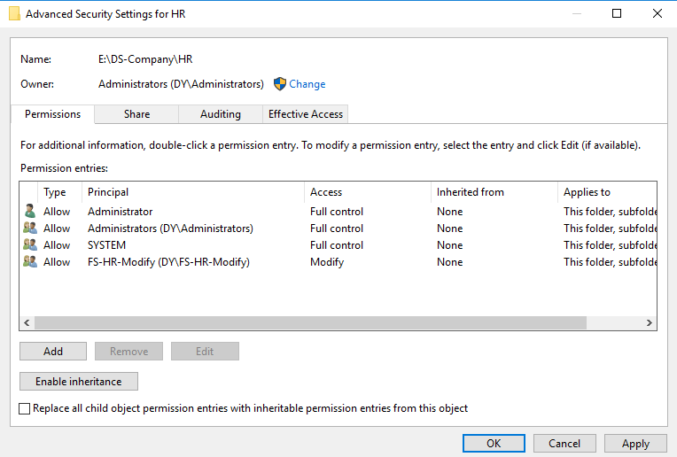
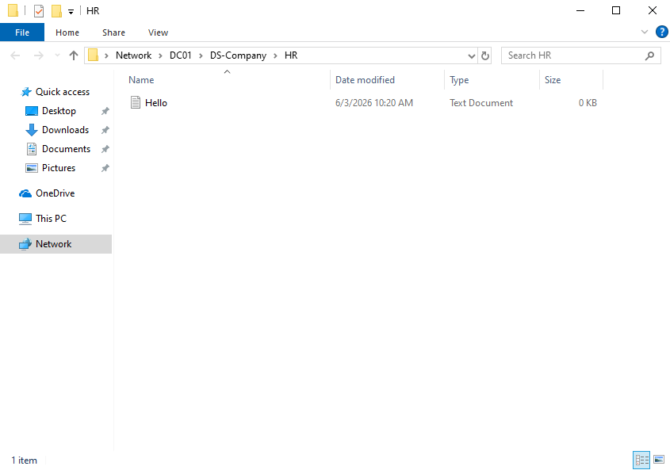
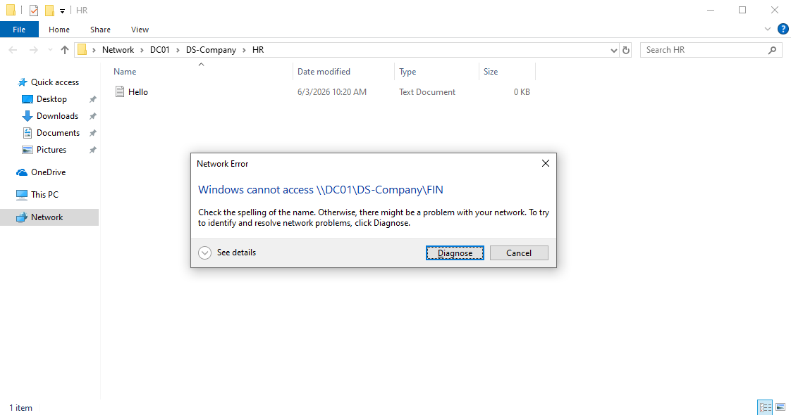
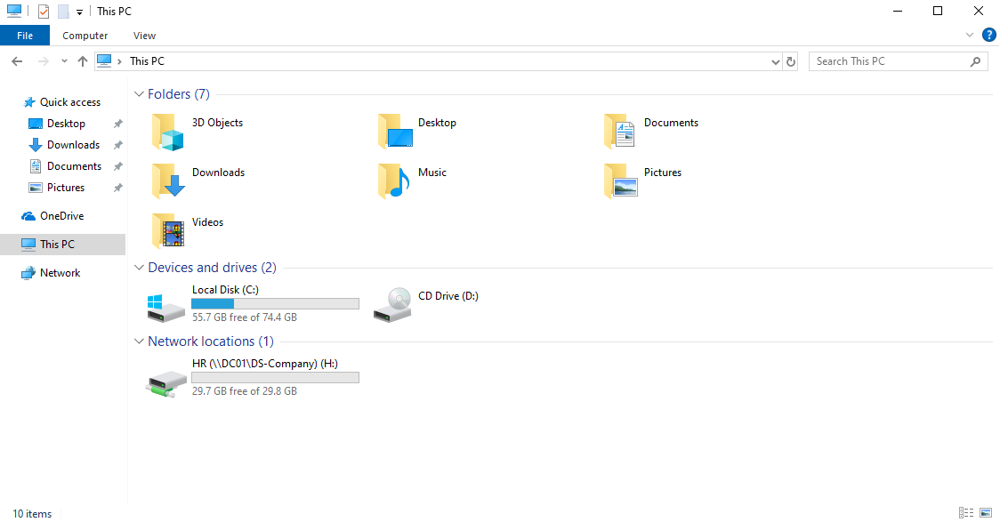

# File Server Lab

## Overview

This lab is part of my Windows Server Infrastructure Lab.

The goal of this section is to configure a basic department-based file server using shared folders, security groups, and NTFS permissions.

In this lab, each department has its own folder, and access is controlled using dedicated File Server security groups.

---

## Lab Environment

| Component         | Details                                                |
| ----------------- | ------------------------------------------------------ |
| Domain            | Days.local                                             |
| Domain Controller | DC01                                                   |
| File Server       | DC01                                                   |
| Shared Folder     | DS-Company                                             |
| Share Path        | `\\DC01\DS-Company`                                    |
| Client            | Windows 10                                             |
| Storage Drive     | E:                                                     |
| Access Control    | Share Permissions + NTFS Permissions + Security Groups |

---

## Folder Structure

I created a main folder called `DS-Company` on drive `E:\`.

Inside the main folder, I created separate folders for each department:

* Finance
* HR
* IT
* Sales

This structure keeps department files organized separately and makes permissions easier to manage.



---

## Shared Folder Path

I shared the main folder `DS-Company` so it can be accessed from client machines over the network.

The network path used in this lab is:

```text
\\DC01\DS-Company
```



---

## Share Permissions

I configured share permissions on the main shared folder `DS-Company`.

Instead of using `Everyone`, I used `Domain Users` to allow only domain users to access the shared path.

The share permission allows users to reach the shared folder over the network, while the actual access to each department folder is controlled using NTFS permissions.

This keeps the share access more controlled and leaves the detailed folder permissions to NTFS security settings.



---

## File Server Security Groups

I created dedicated security groups for File Server permissions.

I also created a dedicated File Server groups location to keep file permission groups organized separately from general department groups.

The File Server groups used in this lab are:

* `FS-HR-Modify`
* `FS-IT-Modify`
* `FS-FIN-Modify`
* `FS-Sales-Modify`

Using dedicated groups makes permission management cleaner and easier to maintain than assigning permissions directly to individual users.



---

## NTFS Permissions

I configured NTFS permissions on each department folder.

Each department folder was assigned to its own File Server security group with Modify access.

For example, the Finance folder was assigned to `FS-FIN-Modify`.



The HR folder was assigned to `FS-HR-Modify`.



This setup allows each department to access its own folder without giving access to other department folders.

In this lab, I used Allow permissions for the required department groups instead of using Deny rules for other departments. This keeps the permission model cleaner and easier to troubleshoot.

---

## Access Test: Successful Access

I tested access from a domain-joined client machine using an HR user account.

The HR user was able to access the HR shared folder and create a test file successfully.



---

## Access Test: Denied Access

Using the same HR user account, I tested access to the Finance folder.

The access was denied because the HR user is not a member of the Finance File Server security group.



This confirms that NTFS permissions are working correctly and that users can only access the folders assigned to their department.

---

## Mapped Drive Result

The HR shared folder was also mapped as a network drive using Group Policy.

The mapped drive appeared on the client machine as drive `H:`.



---

## Skills Practiced

* File Server configuration
* Shared folder creation
* Share permissions
* NTFS permissions
* Security group-based access control
* Department-based folder structure
* Domain user access testing
* Access denied validation
* Mapped network drive verification
* Basic permission troubleshooting

---

## Notes

This lab focused on controlling file access using security groups and NTFS permissions.

Share permissions were used to allow domain users to reach the shared path, while NTFS permissions were used to control the actual access to each department folder.

Future improvements may include access-based enumeration, file screening, storage quotas, auditing, and backup testing.

