# Group Policy Lab

## Overview

This lab is part of my Windows Server Infrastructure Lab.

The goal of this section is to create and link Group Policy Objects to a specific OU, apply different user and computer settings, and verify that the policies are applied successfully on a domain-joined client machine.

In this lab, I used the HR OU as the main target for testing multiple Group Policy settings.

---

## Lab Environment

| Component          | Details                 |
| ------------------ | ----------------------- |
| Domain             | Days.local              |
| Domain Controller  | DC01                    |
| Client             | Windows 10              |
| Target OU          | HR                      |
| Tool               | Group Policy Management |
| Verification Tools | gpupdate, gpresult      |

---

## GPO Linking and Targeting

I linked the required Group Policy Objects to the HR OU.

The purpose of linking GPOs to a specific OU is to apply policies only to the targeted users or computers based on the Active Directory structure.

The policies linked to the HR OU include removable storage restriction, clock removal, mapped drive configuration, and local administrator deployment testing.

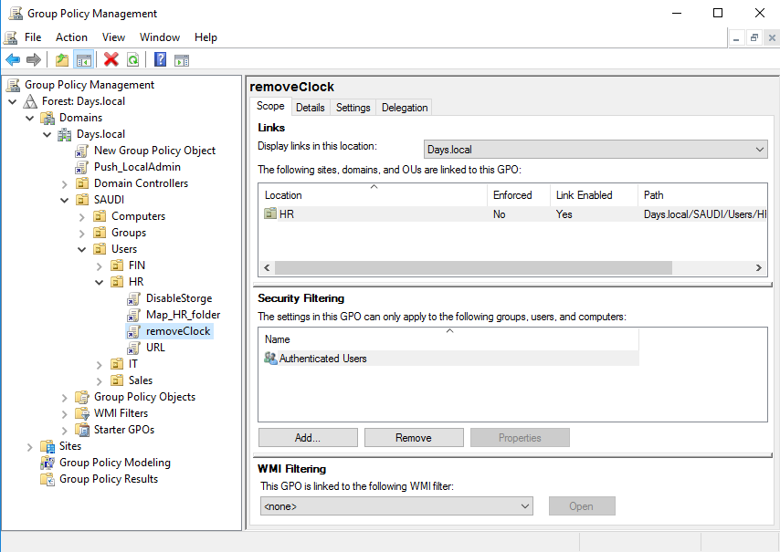

---

## Disable Removable Storage Policy

I configured a policy to restrict removable storage access.

This type of policy can be useful in business environments to reduce the risk of unauthorized data transfer through USB storage devices.

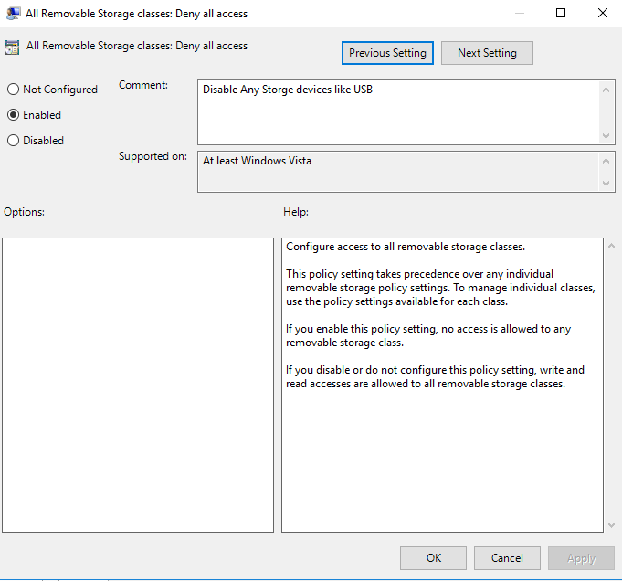

After applying the policy, the client machine was denied access to the removable storage device.

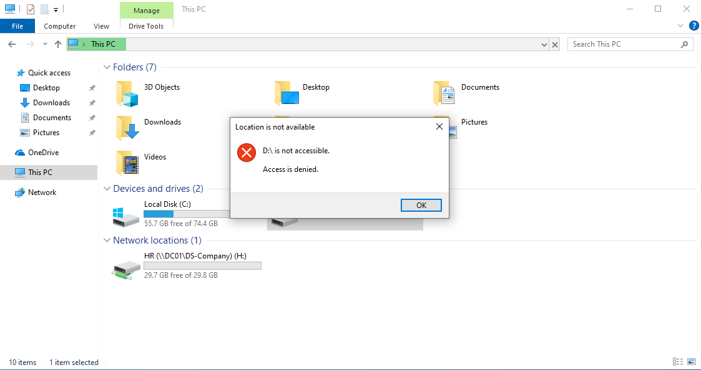

---

## Remove Clock Policy

I configured a user-based policy to remove the clock from the taskbar notification area.

This policy was used as a simple test to verify that user-based Group Policy settings can be applied from the Domain Controller to a domain user.

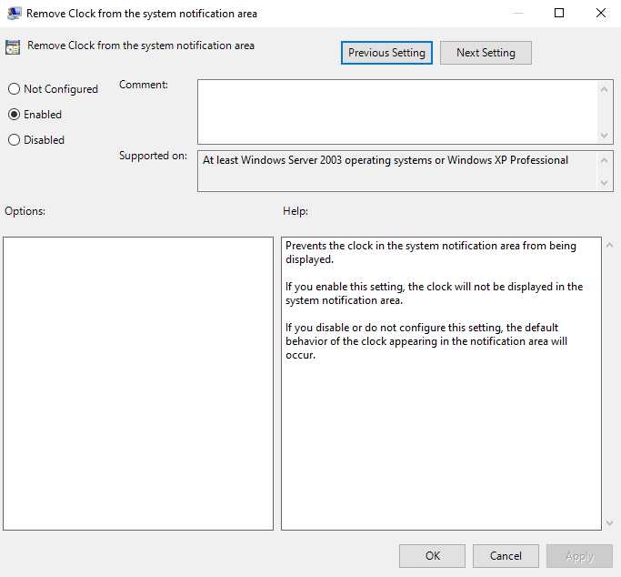

After the policy was applied, the clock was removed from the taskbar notification area on the client machine.

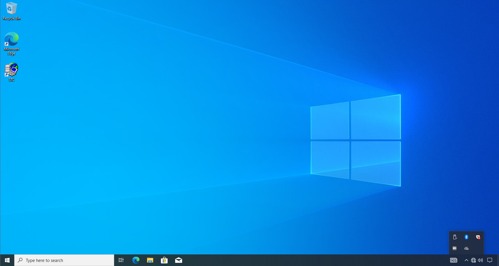

---

## Map Network Drive Policy

I configured a mapped network drive using Group Policy Preferences.

The purpose of this policy is to automatically map a shared folder for users without configuring the drive manually on each client machine.

In this lab, the HR shared folder was mapped as drive `H:` for the HR user.

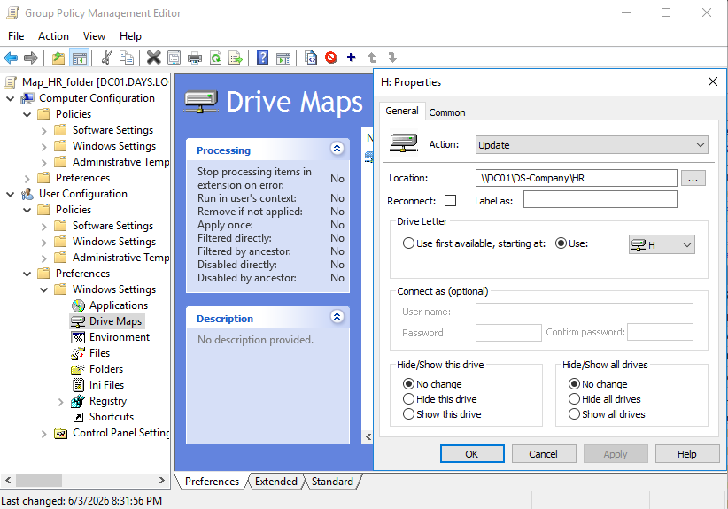

After applying the policy, the mapped drive appeared successfully on the client machine.

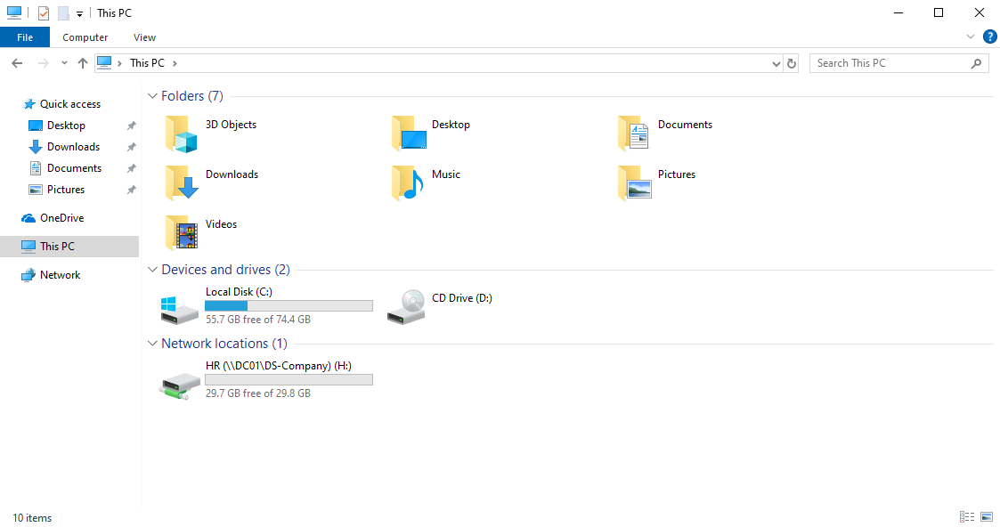

---

## Local Administrator Deployment Test

I tested using Group Policy to deploy a local administrator configuration to a domain-joined client machine.
This test shows how Group Policy can be used to deploy and run a script on domain-joined client machines to automate local computer configuration.

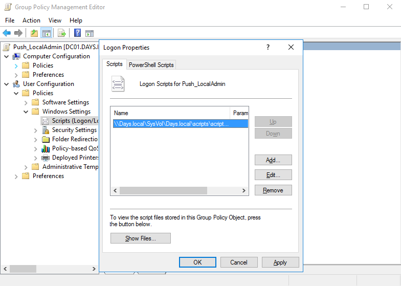

On the client machine, I verified the result by checking the local Administrators group.

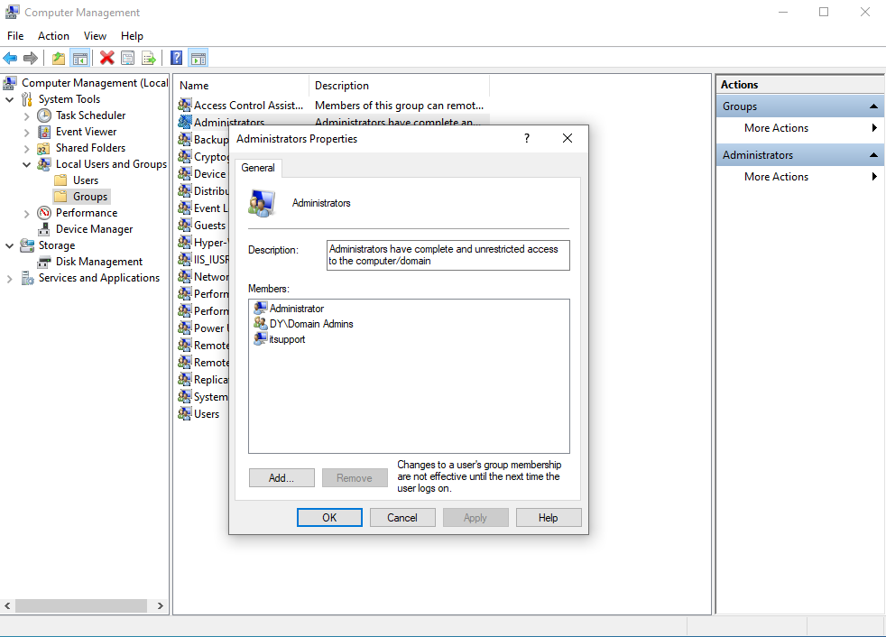

> Note: This was tested only in a lab environment. In a real production environment, local administrator password management should be handled using a secure solution such as Windows LAPS instead of using the same local administrator password on multiple devices.

---

## Policy Search Using Filter Options

I used Filter Options in Group Policy Management Editor to quickly search for specific policy settings instead of browsing manually through all policy categories.

This helped me find the required settings faster while configuring the policies.

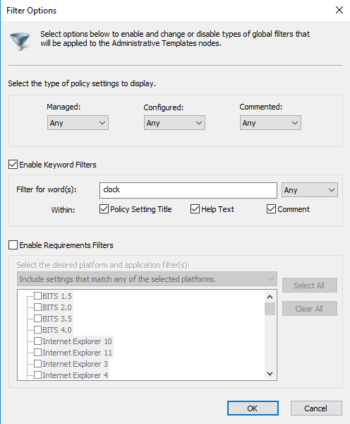

---

## Applying and Verifying Group Policy

On the client machine, I used `gpupdate` to apply the latest Group Policy changes.

Then I used `gpresult /r` to verify which Group Policy Objects were applied to the logged-in domain user.

The result showed that the expected GPOs were applied successfully.

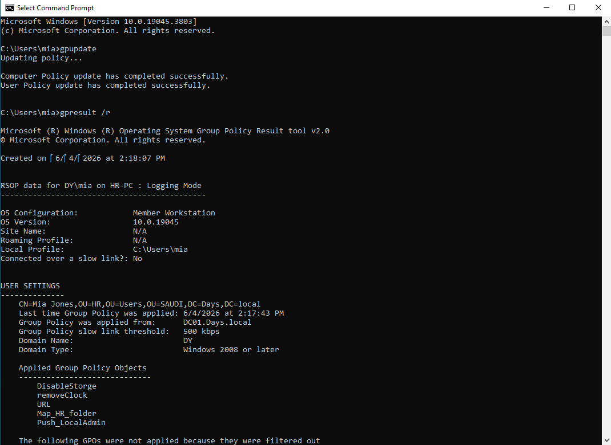

---

## Skills Practiced

* Group Policy Management
* Linking GPOs to OUs
* User-based policy targeting
* Computer and user configuration
* Group Policy Preferences
* Drive mapping using GPO
* Removable storage restriction
* Logon script testing
* gpupdate
* gpresult
* Client-side policy verification
* Basic GPO troubleshooting

---

## Notes

This lab focused on using Group Policy to centrally manage settings in a Windows domain environment.

The policies tested in this section included user experience settings, security-related restrictions, mapped drive automation, and local administrator deployment testing.

Future improvements may include security filtering, WMI filtering, and Windows LAPS.

