# IT Delegation and Access Control Lab

## Overview

In this lab, I designed a simple IT delegation model in Active Directory.

The goal was not to give all IT users full Domain Admin permissions. Instead, I separated IT accounts by role, created security groups, delegated only the required permissions, and verified the results with real tests.

The lab focuses on:

* Separating daily IT accounts from privileged IT accounts
* Creating IT role-based security groups
* Managing AD from an IT workstation using RSAT / ADUC
* Delegating domain join permissions
* Delegating Helpdesk permissions
* Delegating IT Admin / AD Operator permissions
* Applying workstation access using Group Policy
* Testing allowed and denied actions
* Validating changes using Event Viewer and `gpresult`

---

## Tools Used

| Tool                                 | Purpose                                                                                                     |
| ------------------------------------ | ----------------------------------------------------------------------------------------------------------- |
| Active Directory Users and Computers | Create OUs, users, groups, delegated permissions, and move AD objects                                       |
| Group Policy Management              | Create and link GPOs for local admin access, Remote Desktop, firewall rules, and workstation access control |
| RSAT / ADUC on IT Workstation        | Manage AD from an IT workstation without logging directly into the Domain Controller                        |
| Event Viewer                         | Validate domain join, user account changes, and AD object movement                                          |
| CMD / PowerShell                     | Run commands such as `runas`, `gpresult`, and event validation commands                                     |
| Remote Desktop                       | Test remote support access after applying GPO settings                                                      |
| VMware Workstation                   | Run the Windows Server lab environment                                                                      |

---

## Lab Idea

In many environments, IT users need different levels of access.

For example, Helpdesk may need to reset user passwords, workstation support may need to join computers to the domain, and IT Admin may need to create or disable normal users.

Giving Domain Admin access for all these tasks is not a good practice. So in this lab, I built a controlled access model where each IT role gets only the permissions it needs.

```text
Give each IT role only the permissions it needs.
```

---

## IT Account Model

For IT staff, I created two types of accounts:

| Account Type       | Example        | Usage                   |
| ------------------ | -------------- | ----------------------- |
| Daily account      | `jaffar.sheik` | Normal daily work       |
| Privileged account | `pa-it.jaffar` | IT administrative tasks |

I used the same idea for different IT roles:

| Role                | Example Account |
| ------------------- | --------------- |
| Helpdesk            | `pa-hd.almousa` |
| IT Admin            | `pa-it.jaffar`  |
| Workstation Support | `pa-ws.danish`  |

The daily account is used for normal work such as email, browsing, Teams, and opening links or attachments.

This account is more exposed to risks like:

* Phishing emails
* Malicious links
* Unsafe attachments
* Browser-based attacks
* User mistakes

Because of that, I did not assign admin permissions to daily accounts.

If a daily account gets compromised, the attacker should not automatically get IT admin permissions. Administrative permissions were assigned only to privileged IT accounts through security groups.

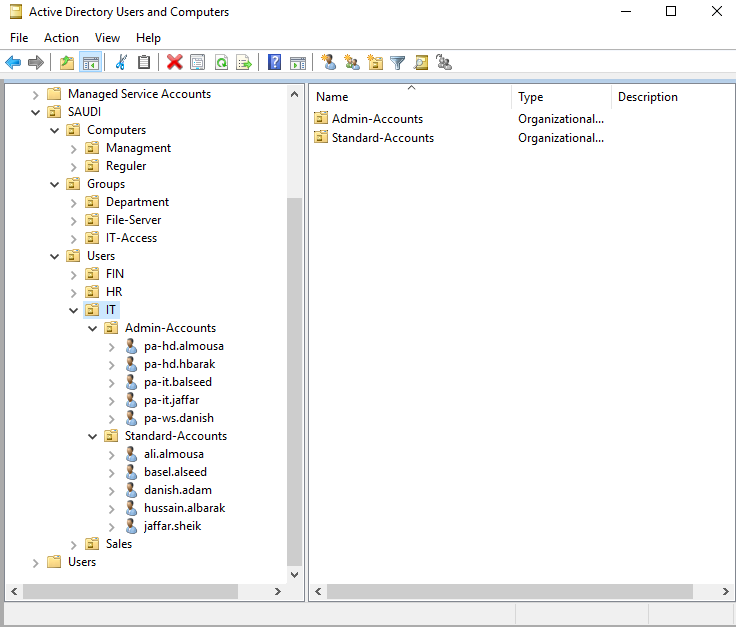

---

## AD OU and Security Group Design

I created a clear OU structure for users, computers, and IT access groups.

The IT accounts were separated into:

* Standard accounts
* Admin accounts

Computers were separated into:

* Regular computers
* Management computers

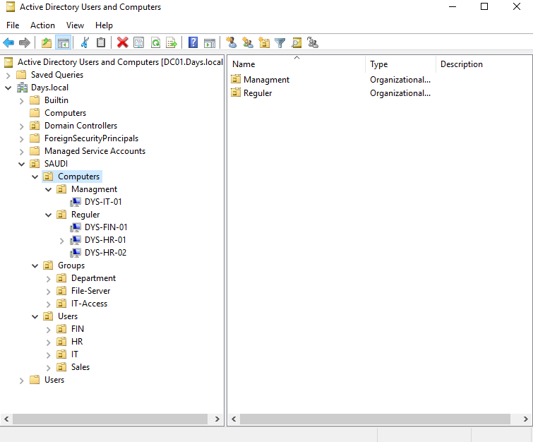

I also created IT security groups to control access by role.

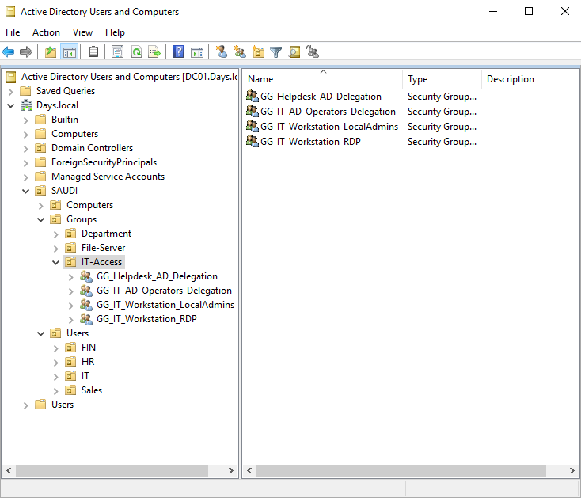

Using groups is better than assigning permissions directly to users because it keeps access easier to manage, review, and audit.

### Main Groups

| Group                           | Purpose                                                               |
| ------------------------------- | --------------------------------------------------------------------- |
| `GG_Helpdesk_AD_Delegation`     | Helpdesk AD tasks such as password reset and computer object movement |
| `GG_IT_AD_Operators_Delegation` | IT Admin / AD Operator tasks for normal users                         |
| `GG_IT_Workstation_LocalAdmins` | Local admin access on regular workstations                            |
| `GG_IT_Workstation_RDP`         | Used to separate Remote Desktop access for workstation support        |

---

## RSAT / ADUC Management from IT Workstation

I used RSAT / Active Directory Users and Computers from an IT workstation instead of logging directly into the Domain Controller.

The IT workstation used in this lab was:

```text
DYS-IT-HD01
```

I opened ADUC using a delegated Helpdesk account:

```cmd
runas /user:pa-hd.almousa@days.local "mmc dsa.msc"
```

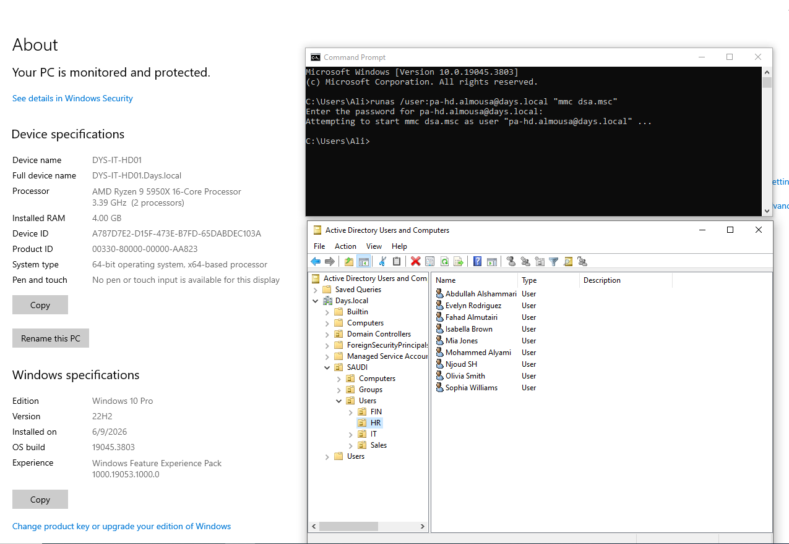

This helps keep normal Helpdesk and IT support tasks away from direct Domain Controller login. The Helpdesk user can work from an IT workstation using only the delegated permissions.

---

## Workstation Support Delegation for Domain Join

I delegated limited permissions to allow the workstation support group to join new computers to the domain.

The permission was applied on the default `Computers` container.

The delegated group was:

```text
GG_IT_Workstation_LocalAdmins
```

The important permission was:

```text
Create Computer objects
```

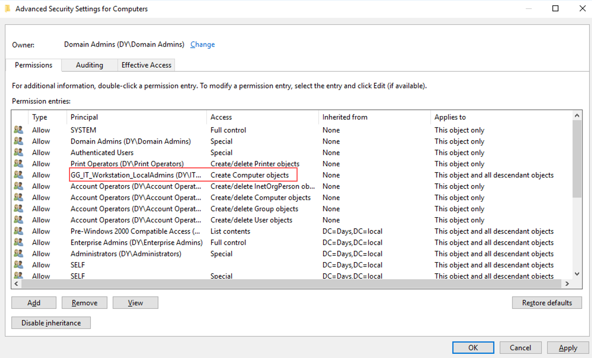

This allows workstation support to join computers to the domain without using a Domain Admin account.

The workstation support account successfully joined a new computer to the domain.

The account used for the test was:

```text
pa-ws.danish
```

The computer joined to the domain was:

```text
DYS-HR-03
```

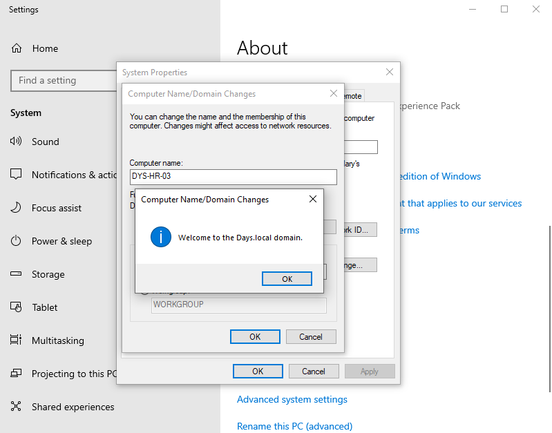

The domain join action was validated in Event Viewer using Event ID `4741`.

```text
Event ID 4741 = A computer account was created
```

The event showed that `pa-ws.danish` created the computer account.

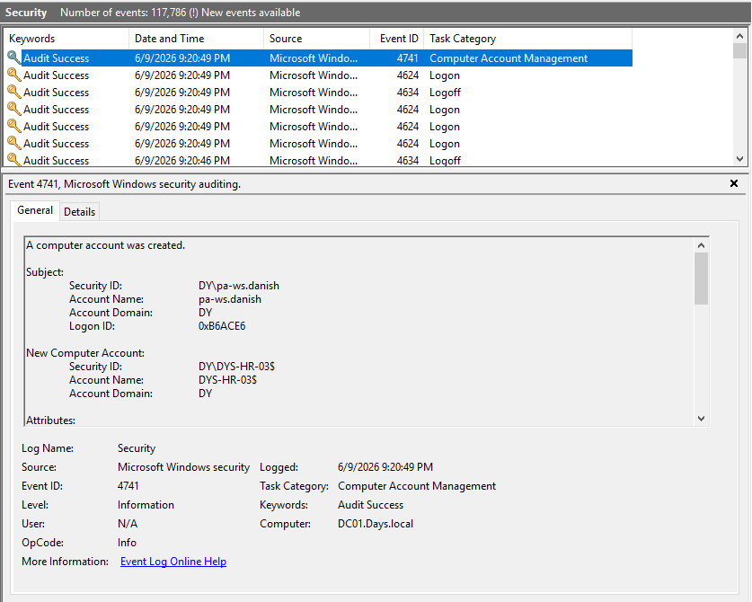

---

## Helpdesk Computer Object Movement

After the computer was joined to the domain, I delegated permissions for Helpdesk to move computer objects from the default `Computers` container to the `Regular` OU.

The delegated group was:

```text
GG_Helpdesk_AD_Delegation
```


When a new workstation is joined to the domain, it may appear first in the default `Computers` container. Helpdesk should be able to organize normal workstations and move them to the correct OU, but without getting access to manage Management computers.

Helpdesk successfully moved the computer object:

```text
DYS-HR-03
```

from:

```text
CN=Computers
```

to:

```text
OU=Regular
```

The move action was verified using Event ID `5139`.

```text
Event ID 5139 = A directory service object was moved
```

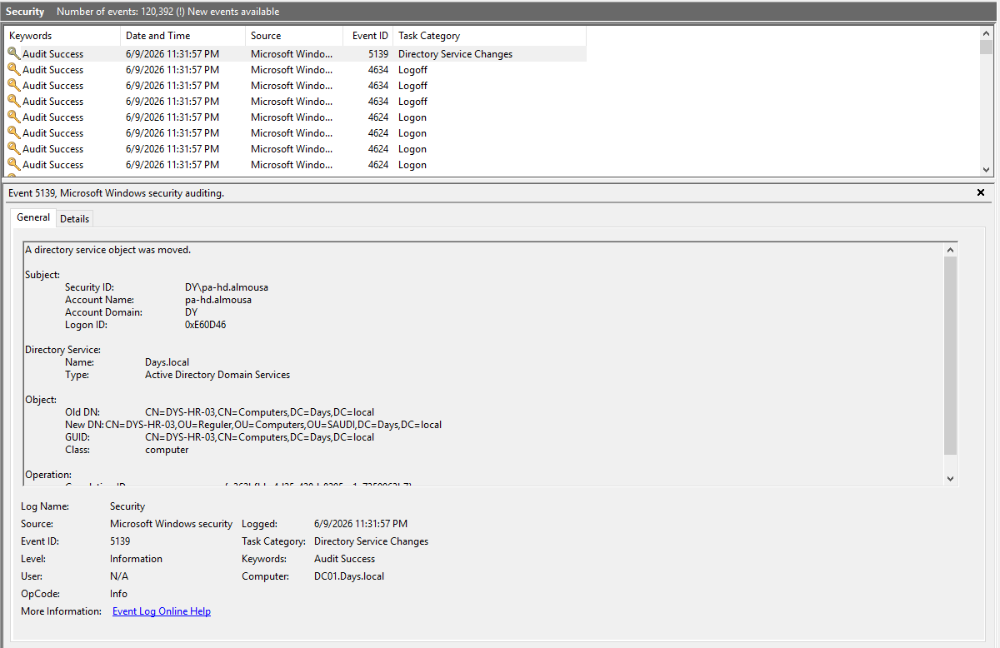

I also tested moving the same computer object to the `Management` OU.

The action was denied.

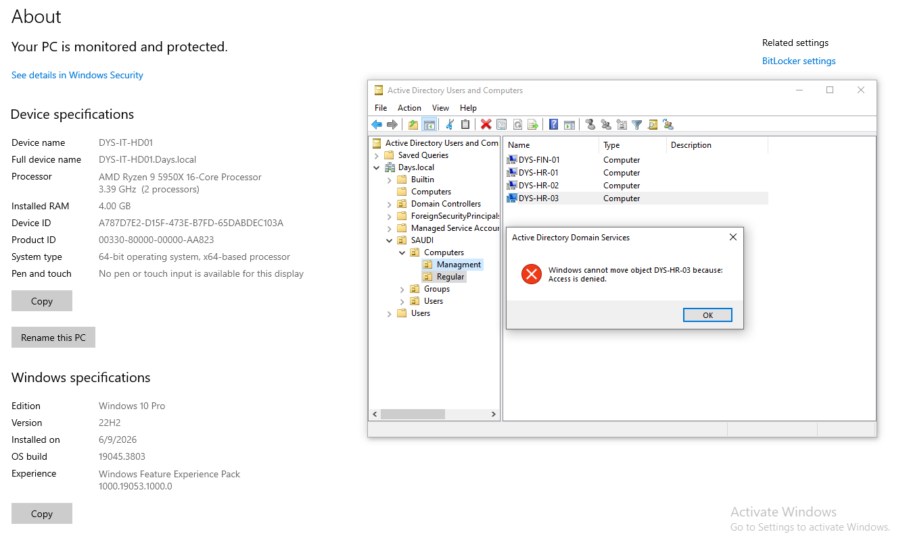

This confirms that Helpdesk can manage regular workstation objects but cannot manage Management computers.

---

## Workstation Access Using Group Policy

I created a GPO for regular workstations.

The GPO was linked to the `Regular` computers OU.

The GPO configured:

* Local admin access for the IT workstation support group
* Remote Desktop access
* Firewall rules for Remote Desktop

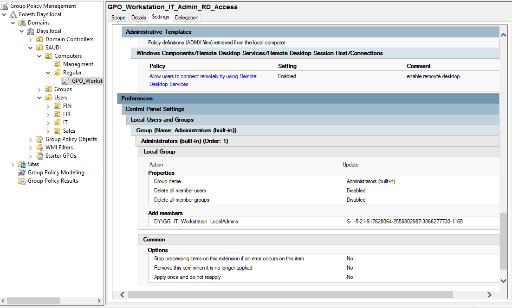

IT support may need local admin access on regular workstations to troubleshoot issues. This access should be controlled by GPO and applied only to the correct OU.

The GPO was linked to the `Regular` OU so the policy does not apply to Management computers or servers.

The group `GG_IT_Workstation_LocalAdmins` was added to the local Administrators group on the workstation.

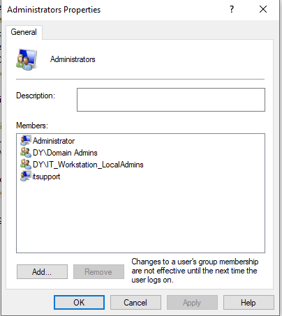

I verified that the GPO was applied using `gpresult`.

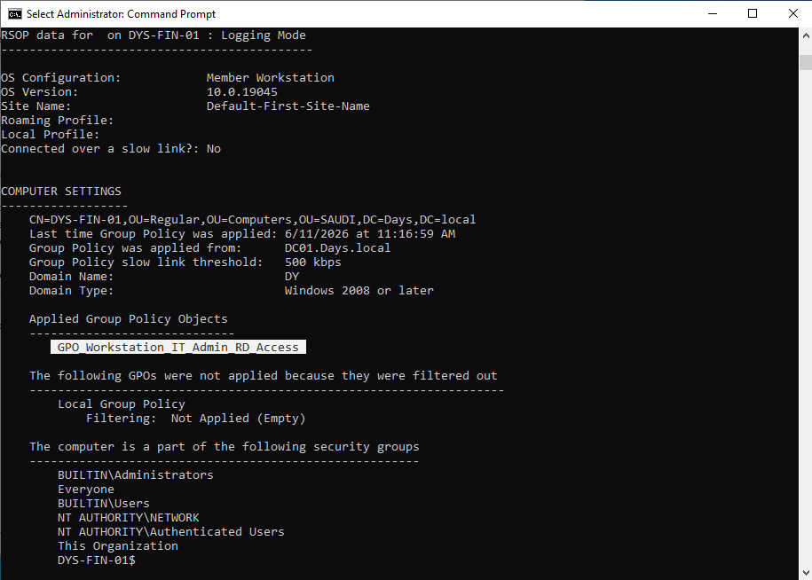

After the policy was applied, I tested Remote Desktop access to the workstation.

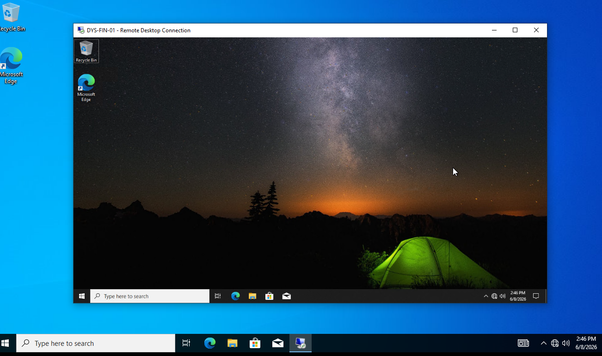

The workstation received the policy successfully. The IT workstation support group had local admin access on the regular workstation, and Remote Desktop access worked after the GPO was applied.

---

## Helpdesk User Delegation

I delegated password reset permissions to the Helpdesk group on the HR OU.

The delegated group was:

```text
GG_Helpdesk_AD_Delegation
```

The delegated task was:

```text
Reset user passwords and force password change at next logon
```

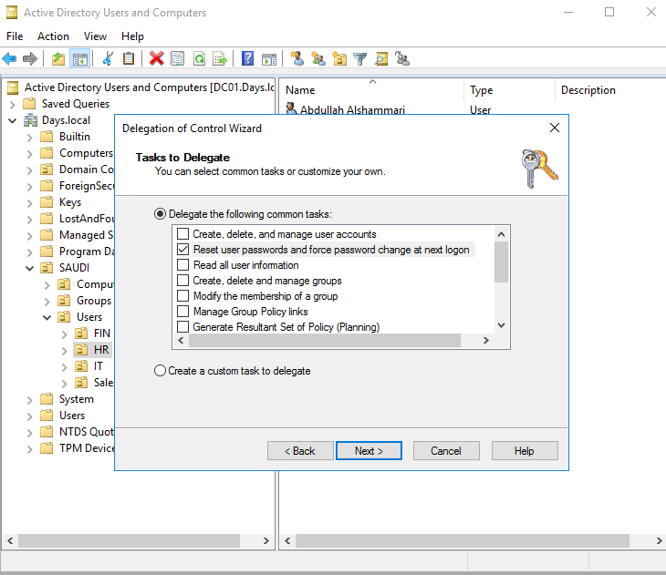

The permission was also verified from Advanced Security settings.

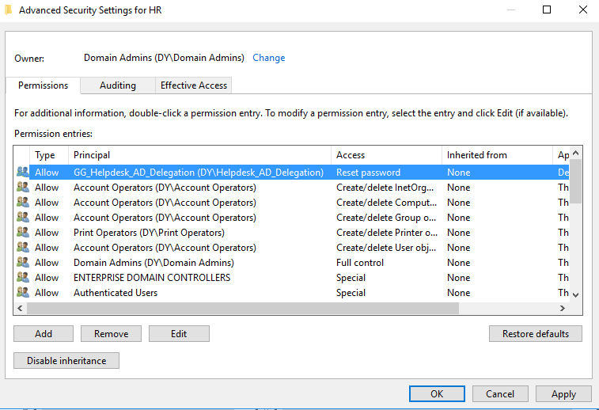

Helpdesk usually needs to reset passwords for normal users, but Helpdesk should not have full control over all users or privileged IT accounts.

The Helpdesk account successfully reset a password for a normal HR user.

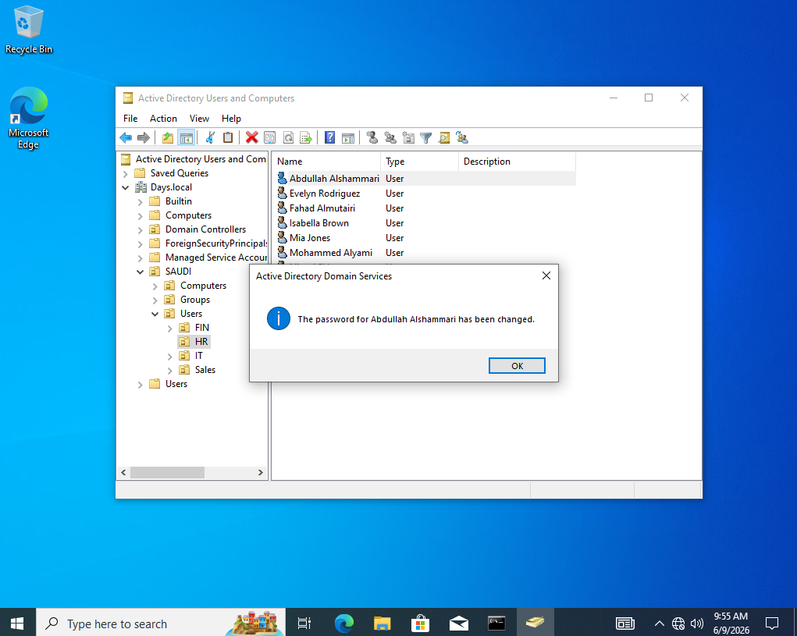

The same Helpdesk account was denied when trying to perform a privileged action on an IT account.

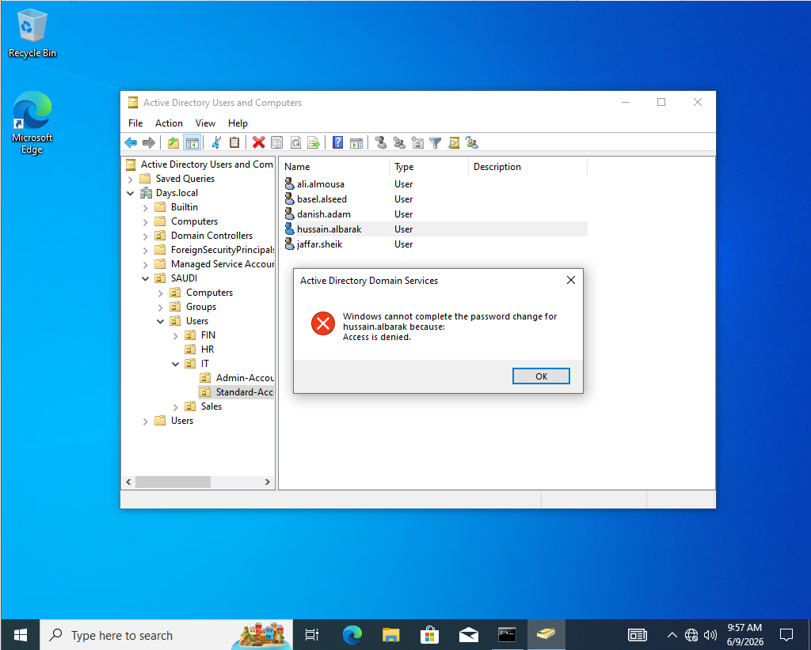

This confirms that Helpdesk has limited access only.

---

## IT Admin / AD Operator Delegation

I created a higher IT role for AD Operator tasks.

The delegated group was:

```text
GG_IT_AD_Operators_Delegation
```

This role was allowed to perform normal user administration tasks such as:

* Create normal users
* Modify normal users
* Disable users
* Reset passwords

The permissions were delegated on normal user OUs such as HR.

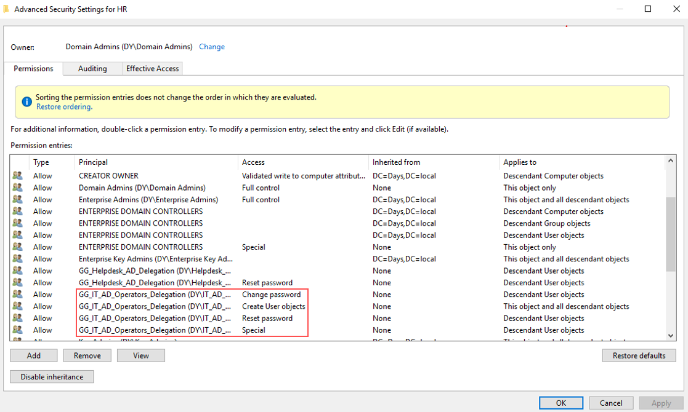

IT Admin / AD Operator needs more access than Helpdesk, but that still does not mean the account should be Domain Admin.

The IT Admin account was able to perform normal user management tasks.

User account changes were validated from Event Viewer.

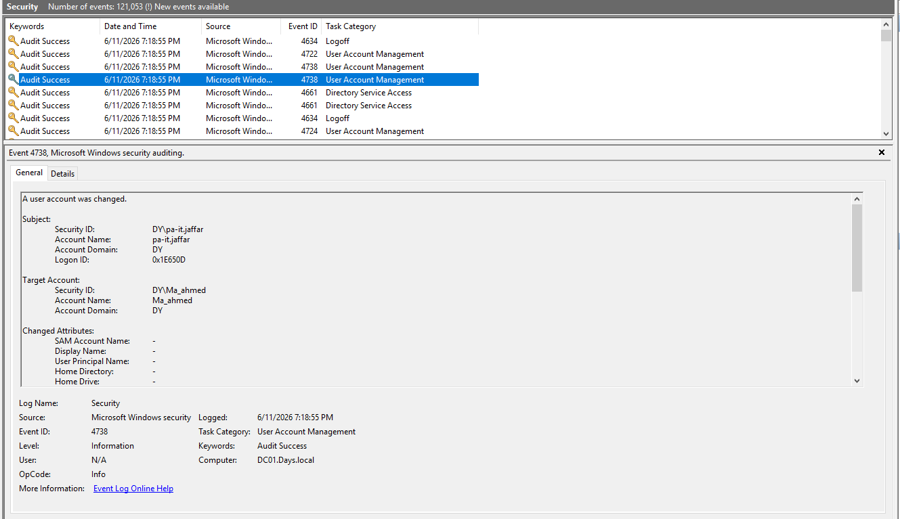

A disabled user action was also validated.

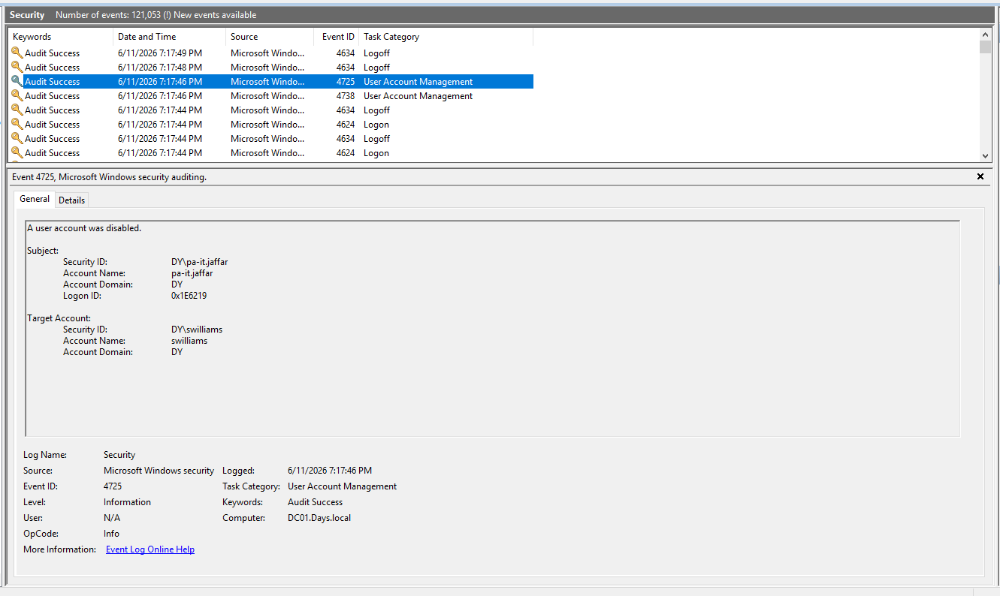

The IT Admin account was denied when trying to delete a user.

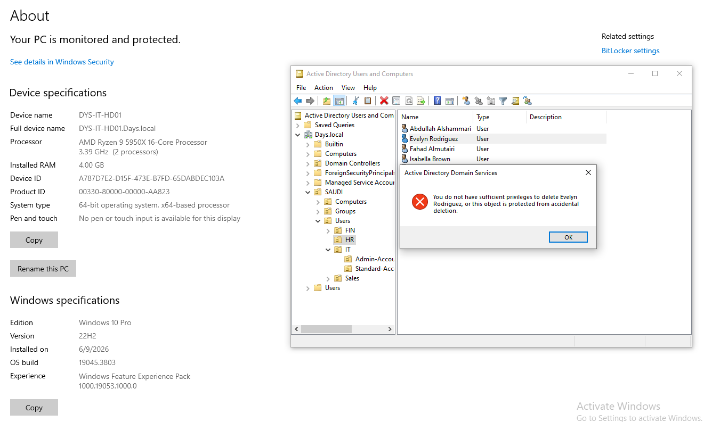

This confirms that the IT Admin role has more access than Helpdesk, but still does not have full control.

---

## Access Control Summary

| Role                   | Allowed                                                           | Denied                                              |
| ---------------------- | ----------------------------------------------------------------- | --------------------------------------------------- |
| Helpdesk               | Reset HR user passwords, move regular computer objects            | Privileged IT accounts, Management computers        |
| Workstation Support    | Join computers to the domain, local admin on regular workstations | Domain Admin access, Management / server access     |
| IT Admin / AD Operator | Create, modify, disable, and reset normal users                   | Delete users, privileged areas, full domain control |

---

## Main Security Points

This lab follows a least privilege approach.

The main security decisions were:

* Daily IT accounts do not have admin permissions.
* Privileged IT accounts are separated from daily accounts.
* IT permissions are assigned through groups.
* Helpdesk has limited delegated access.
* Workstation support can support regular PCs without Domain Admin.
* IT Admin has more permissions than Helpdesk, but still limited.
* Management computers and privileged accounts are protected.
* Allowed and denied tests were performed to confirm the access boundaries.

---

## Troubleshooting Notes

During the lab, I faced some issues and fixed them:

* RSAT installation failed at first because the workstation DNS was not resolving Microsoft update sources correctly.
* Remote Desktop did not work at first because it was disabled on the target workstation.
* Moving computer objects required specific permissions on the source and destination locations.
* Event Viewer validation required checking the correct security events.

---

## Future Improvements

Possible improvements for a more production-like setup:

* Add a dedicated Staging OU for newly joined computers.
* Redirect new computer objects to the Staging OU.
* Restrict RDP firewall scope to IT workstations only.
* Add Windows LAPS for local administrator password management.
* Add more detailed auditing for privileged AD actions.
* Automate some onboarding tasks with PowerShell.
