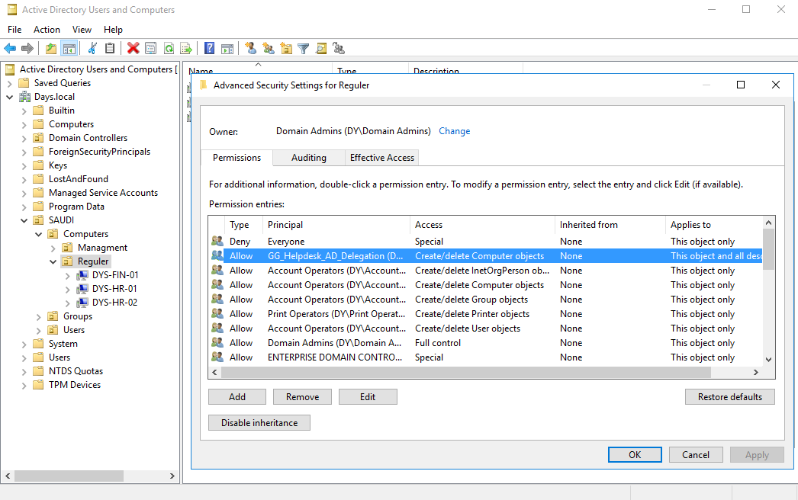

# IT Delegation and Access Control Lab

## Overview

In this lab, I built a simple IT delegation model in Active Directory.

The main goal was to avoid giving all IT users full Domain Admin permissions. Instead, I separated IT accounts by role, created security groups, delegated only the required permissions, and tested both allowed and denied actions.

This lab covers:

* Daily and privileged IT account separation
* Role-based security groups
* RSAT / ADUC management from an IT workstation
* Domain join delegation
* Helpdesk delegation
* IT Admin / AD Operator delegation
* Workstation access using Group Policy
* Event Viewer and `gpresult` validation

---

## Tools Used

| Tool                                 | Purpose                                                                                                     |
| ------------------------------------ | ----------------------------------------------------------------------------------------------------------- |
| Active Directory Users and Computers | Create OUs, users, groups, delegated permissions, and move AD objects                                       |
| Group Policy Management              | Create and link GPOs for local admin access, Remote Desktop, firewall rules, and workstation access control |
| RSAT / ADUC on IT Workstation        | Manage AD from an IT workstation without logging directly into the Domain Controller                        |
| Event Viewer                         | Validate domain join, user account changes, and AD object movement                                          |
| CMD / PowerShell                     | Run commands such as `runas`, `gpresult`, and event validation commands                                     |
| Remote Desktop                       | Test remote support access after applying GPO settings                                                      |
| VMware Workstation                   | Run the Windows Server lab environment                                                                      |

---

## Lab Idea

In real IT environments, not every IT user should have the same level of access.

For example, Helpdesk may need to reset user passwords, workstation support may need to join computers to the domain, and IT Admins may need to create or disable normal users.

Giving Domain Admin access for all these tasks is not a good practice. For this reason, I created a role-based access model where each IT role gets only the permissions needed for its job.

```text
Give each IT role only the permissions it needs.
```

---

## IT Account Model

For IT staff, I created two types of accounts:

| Account Type       | Example        | Usage                   |
| ------------------ | -------------- | ----------------------- |
| Daily account      | `jaffar.sheik` | Normal daily work       |
| Privileged account | `pa-it.jaffar` | IT administrative tasks |

Examples of privileged accounts used in this lab:

| Role                | Example Account |
| ------------------- | --------------- |
| Helpdesk            | `pa-hd.almousa` |
| IT Admin            | `pa-it.jaffar`  |
| Workstation Support | `pa-ws.danish`  |

The daily account is used for normal work such as email, browsing, Teams, and opening links or attachments. This type of account is more exposed to phishing emails, malicious links, unsafe attachments, browser attacks, and normal user mistakes.

Because of that, I did not assign administrative permissions to daily accounts. If a daily account gets compromised, the attacker should not automatically get IT admin permissions.

Administrative access was assigned only to privileged accounts through security groups.


---

## AD OU and Security Group Design

I created an OU structure to separate users, computers, and IT access groups.

IT accounts were separated into standard accounts and admin accounts. Computers were also separated into regular computers and management computers.


I also created security groups for different IT roles instead of assigning permissions directly to users.


| Group                           | Purpose                                                               |
| ------------------------------- | --------------------------------------------------------------------- |
| `GG_Helpdesk_AD_Delegation`     | Helpdesk AD tasks such as password reset and computer object movement |
| `GG_IT_AD_Operators_Delegation` | IT Admin / AD Operator tasks for normal users                         |
| `GG_IT_Workstation_LocalAdmins` | Local admin access on regular workstations                            |
| `GG_IT_Workstation_RDP`         | Used to separate Remote Desktop access for workstation support        |

Using groups makes the access model easier to manage, review, and audit.

---

## RSAT / ADUC Management from IT Workstation

AD administration was tested from an IT workstation using RSAT / Active Directory Users and Computers.

The IT workstation used in this lab was:

```text
DYS-IT-HD01
```

ADUC was opened using a delegated Helpdesk account:

```cmd
runas /user:pa-hd.almousa@days.local "mmc dsa.msc"
```


This keeps normal Helpdesk work away from direct Domain Controller login. The Helpdesk user can perform delegated tasks from an IT workstation without needing full domain privileges.

---

## Workstation Support Delegation for Domain Join

The workstation support group was delegated permission to join new computers to the domain.

The delegated group was:

```text
GG_IT_Workstation_LocalAdmins
```

The important permission was:

```text
Create Computer objects
```

The permission was applied on the default `Computers` container.


This allows workstation support to join computers to the domain without using a Domain Admin account.

The test was done using:

```text
pa-ws.danish
```

The new computer was:

```text
DYS-HR-03
```


The domain join action was validated in Event Viewer using Event ID `4741`.

```text
Event ID 4741 = A computer account was created
```

The event showed that the delegated workstation support account created the computer account.


---

## Helpdesk Computer Object Movement

After the computer was joined to the domain, Helpdesk needed to move the computer object from the default `Computers` container to the correct OU.

The delegated group was:

```text
GG_Helpdesk_AD_Delegation
```



This allows Helpdesk to organize regular workstation objects without giving them access to manage Management computers.

The test computer was moved:

```text
DYS-HR-03
```

from:

```text
CN=Computers
```

to:

```text
OU=Regular
```

The move action was verified using Event ID `5139`.

```text
Event ID 5139 = A directory service object was moved
```


I also tested moving the same computer object to the `Management` OU, and the action was denied.


This confirms that Helpdesk can manage regular workstation placement, but cannot manage Management devices.

---

## Workstation Access Using Group Policy

I created a GPO for regular workstations and linked it to the `Regular` computers OU.

The GPO configured:

* Local admin access for the IT workstation support group
* Remote Desktop access
* Firewall rules for Remote Desktop


The GPO was linked to the `Regular` OU so it applies to normal workstations only. It should not apply to Management computers or servers.

The group `GG_IT_Workstation_LocalAdmins` was added to the local Administrators group on the workstation.


The GPO application was verified using `gpresult`.


After the policy was applied, Remote Desktop access was tested successfully.


The result confirms that the workstation received the policy, the IT workstation support group became local admin on the regular workstation, and Remote Desktop worked after the GPO was applied.

---

## Helpdesk User Delegation

The Helpdesk group was delegated password reset permissions on the HR OU.

The delegated group was:

```text
GG_Helpdesk_AD_Delegation
```

The delegated task was:

```text
Reset user passwords and force password change at next logon
```


The permission was also checked from Advanced Security settings.


The Helpdesk account successfully reset a password for a normal HR user.


The same Helpdesk account was denied when trying to perform a privileged action on an IT account.


This confirms that Helpdesk has limited access only.

---

## IT Admin / AD Operator Delegation

I created a higher IT role for AD Operator tasks.

The delegated group was:

```text
GG_IT_AD_Operators_Delegation
```

This role was allowed to perform normal user administration tasks such as:

* Create normal users
* Modify normal users
* Disable users
* Reset passwords

The permissions were delegated on normal user OUs such as HR.


This role has more access than Helpdesk, but it is still not Domain Admin.

User account changes were validated from Event Viewer.


A disabled user action was also validated.


The IT Admin account was denied when trying to delete a user.


This confirms that the IT Admin role can manage normal users, but still does not have full control.

---

## Access Control Summary

| Role                   | Allowed                                                           | Denied                                              |
| ---------------------- | ----------------------------------------------------------------- | --------------------------------------------------- |
| Helpdesk               | Reset HR user passwords, move regular computer objects            | Privileged IT accounts, Management computers        |
| Workstation Support    | Join computers to the domain, local admin on regular workstations | Domain Admin access, Management / server access     |
| IT Admin / AD Operator | Create, modify, disable, and reset normal users                   | Delete users, privileged areas, full domain control |

---

## Main Security Points

This lab follows a least privilege approach.

The main security decisions were:

* Daily IT accounts do not have admin permissions.
* Privileged IT accounts are separated from daily accounts.
* IT permissions are assigned through groups.
* Helpdesk has limited delegated access.
* Workstation support can support regular PCs without Domain Admin.
* IT Admin has more permissions than Helpdesk, but still limited.
* Management computers and privileged accounts are protected.
* Allowed and denied tests were performed to confirm the access boundaries.

---

## Troubleshooting Notes

During the lab, I faced some issues and fixed them:

* RSAT installation failed at first because the workstation DNS was not resolving Microsoft update sources correctly.
* Remote Desktop did not work at first because it was disabled on the target workstation.
* Moving computer objects required specific permissions on the source and destination locations.
* Event Viewer validation required checking the correct security events.

---

## Future Improvements

Possible improvements for a more production-like setup:

* Add a dedicated Staging OU for newly joined computers.
* Redirect new computer objects to the Staging OU.
* Restrict RDP firewall scope to IT workstations only.
* Add Windows LAPS for local administrator password management.
* Add more detailed auditing for privileged AD actions.
* Automate some onboarding tasks with PowerShell.
