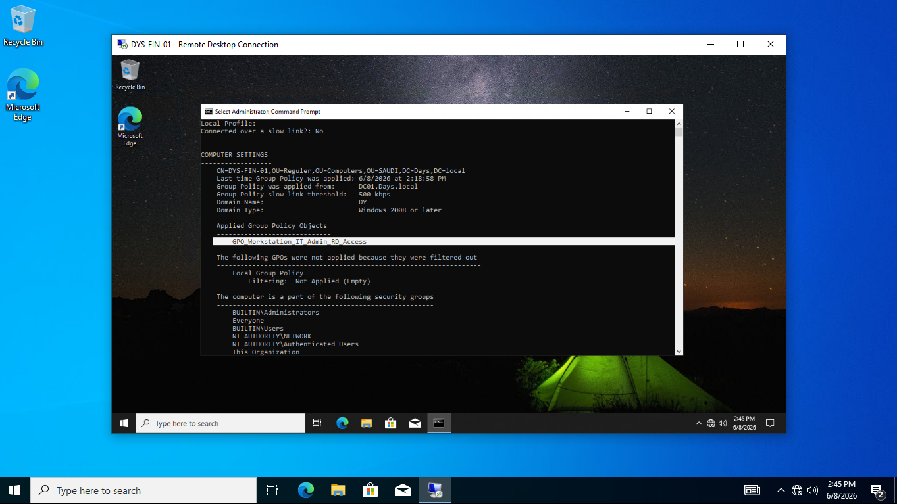
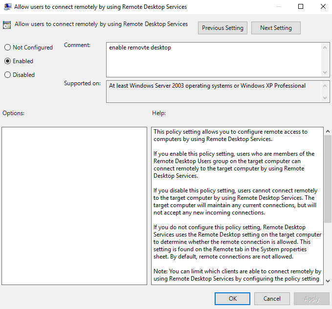
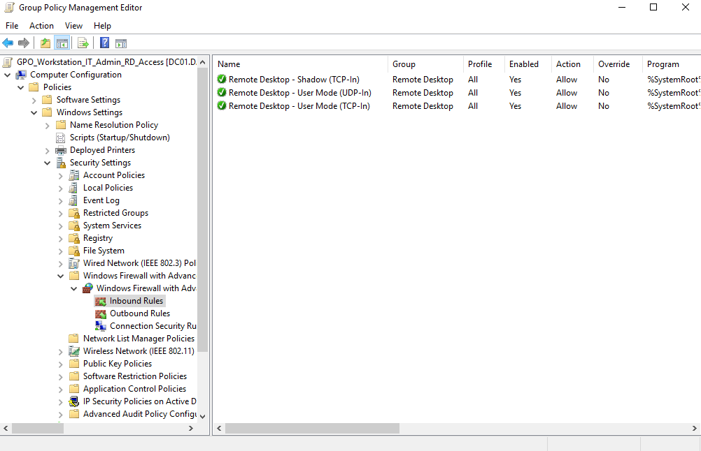
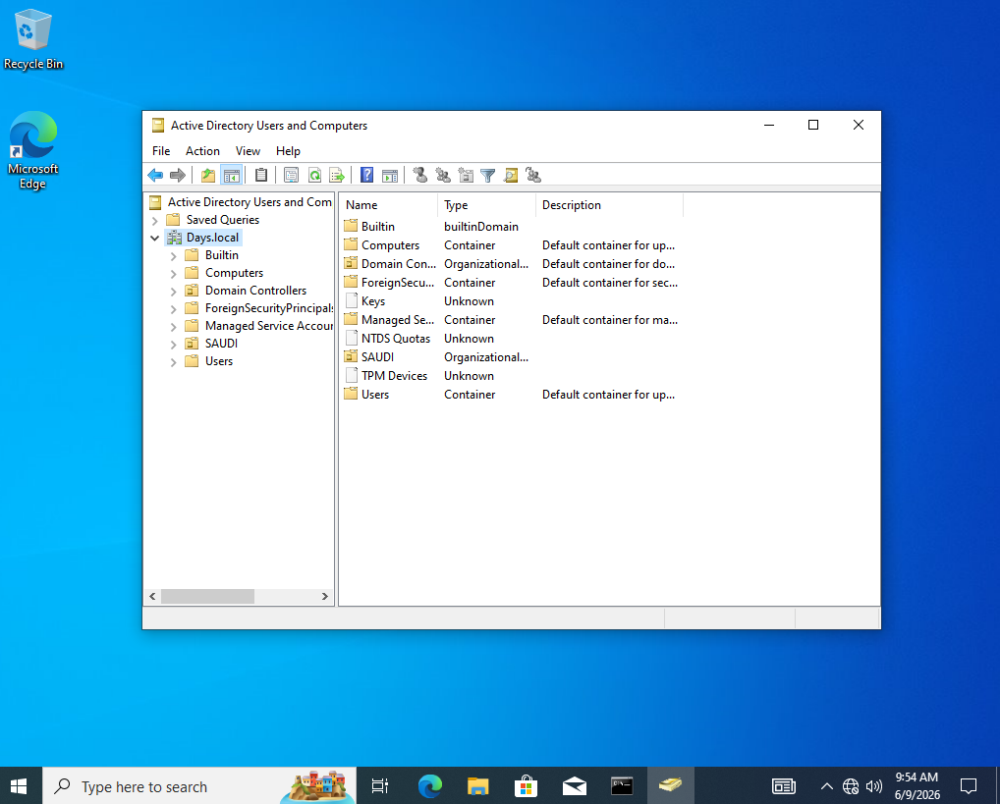

# IT Delegation and Access Control Lab

## Overview

This lab focuses on designing a practical IT access model in Active Directory without giving normal IT users full Domain Admin permissions.

The idea is to separate IT roles, assign permissions through security groups, and verify that each role can only perform the tasks it needs.

The lab covers:

* IT OU and account structure
* Privileged IT accounts
* Role-based security groups
* Helpdesk delegation
* IT Admin / AD Operator delegation
* Workstation local admin access using GPO
* Remote Desktop access using GPO
* Domain join delegation
* Computer object movement between OUs
* Event Viewer validation
* Allowed and denied access testing

---

## Tools Used

| Tool                                 | Purpose                                                               |
| ------------------------------------ | --------------------------------------------------------------------- |
| Active Directory Users and Computers | Manage OUs, users, groups, delegation, and computer objects           |
| Group Policy Management              | Apply workstation access policies                                     |
| RSAT / ADUC on IT workstation        | Manage AD without logging in directly to the Domain Controller        |
| Event Viewer                         | Verify domain join, user changes, and computer object movement        |
| CMD / PowerShell                     | Run validation commands such as `runas`, `gpresult`, and event checks |
| Remote Desktop                       | Test remote support access to regular workstations                    |
| VMware Workstation                   | Run the lab environment                                               |

---

## Lab Design

The lab separates normal user accounts from privileged IT accounts.

| Account Type                | Example           |
| --------------------------- | ----------------- |
| Standard user account       | `hussain.albarak` |
| Helpdesk privileged account | `pa-hd.hbarak`    |
| IT Admin privileged account | `pa-it.jaffar`    |
| Workstation Support account | `pa-ws.danish`    |

The main idea:

* Standard accounts are used for daily work.
* Privileged accounts are used only for IT tasks.
* Permissions are assigned through groups, not directly to users.


---

## Security Groups

The following security groups were created to separate IT responsibilities:

| Group                           | Purpose                                                                   |
| ------------------------------- | ------------------------------------------------------------------------- |
| `GG_Helpdesk_AD_Delegation`     | Helpdesk tasks such as password reset and moving regular computer objects |
| `GG_IT_AD_Operators_Delegation` | Higher IT Admin tasks on normal user accounts                             |
| `GG_IT_Workstation_LocalAdmins` | Local admin access on regular workstations                                |
| `GG_IT_Workstation_RDP`         | Remote Desktop access to regular workstations                             |


---

## Computer OU Structure

Computers were separated into different OUs:

* `Regular`
* `Management`

The `Regular` OU is used for normal employee computers.
The `Management` OU is more restricted and should not be managed by Helpdesk users.


---

## Domain Join Delegation

A workstation support account was allowed to join a new computer to the domain without using a Domain Admin account.

The test was done using:

```text
pa-ws.danish
```

The computer was successfully joined to the domain.


The domain join action was also verified in Event Viewer using Event ID `4741`.

```text
Event ID 4741 = A computer account was created
```

The event showed that `pa-ws.danish` created the computer account `DYS-HR-03`.


The delegated permissions on the default Computers container were also reviewed.


---

## Moving Computer Objects

After the computer was joined to the domain, Helpdesk was allowed to move the computer object from the default `Computers` container to the `Regular` OU.

The required permissions were applied so Helpdesk could move regular workstation computer objects without getting access to Management computers.


The move action was verified in Event Viewer using Event ID `5139`.

```text
Event ID 5139 = A directory service object was moved
```

The event showed that `pa-hd.almousa` moved `DYS-HR-03` from `CN=Computers` to the `Regular` OU.


Helpdesk was denied when trying to move the computer object to the `Management` OU.


This confirms that Helpdesk can organize regular workstation objects but cannot manage Management devices.

---

## Workstation Access by GPO

A Group Policy was created and linked to the Regular workstations OU.

The GPO was used to:

* Add the IT workstation local admin group to the local Administrators group
* Enable Remote Desktop
* Allow Remote Desktop through Windows Firewall


The workstation support group was added to the local Administrators group on the target workstation.


Remote Desktop was enabled through Group Policy.


The GPO application was verified using `gpresult`.



Remote Desktop access was tested successfully.


The RDP setting and firewall rule were also configured through GPO.





---

## RSAT and ADUC from IT Workstation

Helpdesk administration was tested from an IT workstation using RSAT / ADUC.

This avoids logging in directly to the Domain Controller for normal Helpdesk tasks.

ADUC was opened using a delegated Helpdesk account:

```cmd
runas /user:pa-hd.almousa@days.local "mmc dsa.msc"
```




---

## Helpdesk Delegation

The Helpdesk group was delegated permission to reset passwords for users inside the HR OU.


The delegation entry was verified from Advanced Security settings.


A Helpdesk account successfully reset a password for a normal HR user.


The same Helpdesk account was denied when trying to perform a privileged action.


This confirms that Helpdesk has limited permissions only.

---

## IT Admin / AD Operator Delegation

The IT Admin / AD Operator group was given higher permissions than Helpdesk, but still without Domain Admin rights.

The IT Admin role was allowed to perform normal user administration tasks such as:

* Create normal users
* Modify normal users
* Disable users
* Reset passwords

The IT Operator delegation entry was reviewed from the HR OU security settings.


User account changes were verified from Event Viewer.


A disabled user action was also verified.


The IT Admin account was denied when trying to delete a user.


This confirms that the IT Admin role has more access than Helpdesk, but still does not have full control.

---

## Access Control Summary

| Role                   | Allowed                                               | Denied                                              |
| ---------------------- | ----------------------------------------------------- | --------------------------------------------------- |
| Helpdesk               | Reset HR user passwords, move computers to Regular OU | Privileged actions, Management computers            |
| Workstation Support    | Join computers to domain, local admin on Regular PCs  | Management / Server access                          |
| IT Admin / AD Operator | Create, modify, disable, and reset normal users       | Delete users, Domain Admins, GPOs, privileged areas |

---

## Security Notes

This lab follows a least privilege approach.

Instead of giving IT users Domain Admin permissions, access was separated by role:

* Helpdesk has limited delegated tasks.
* Workstation Support can join computers to the domain and support regular workstations.
* IT Admin has higher AD permissions, but still limited.
* Management computers and privileged accounts remain restricted.

This design makes access easier to control, easier to audit, and safer than using one high-privilege account for all tasks.

---

## Troubleshooting Notes

During the lab, some issues appeared and were fixed:

* RSAT installation failed at first because the workstation DNS was not resolving Microsoft update sources correctly.
* Remote Desktop did not work at first because RDP was disabled on the target workstation.
* Computer object movement required more than basic create permissions. The permissions had to allow Helpdesk to move computer objects from the default container into the Regular OU.
* Event Viewer validation required the correct audit settings to capture directory service changes.

---

## Future Improvements

Possible improvements for a more production-like design:

* Add a dedicated Staging OU for newly joined computers.
* Restrict RDP firewall scope to dedicated IT workstations only.
* Add Windows LAPS to manage local administrator passwords.
* Add a dedicated workstation provisioning group instead of combining multiple workstation support tasks.
* Add PowerShell scripts to automate common IT onboarding tasks.

